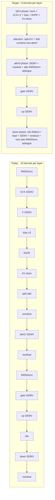
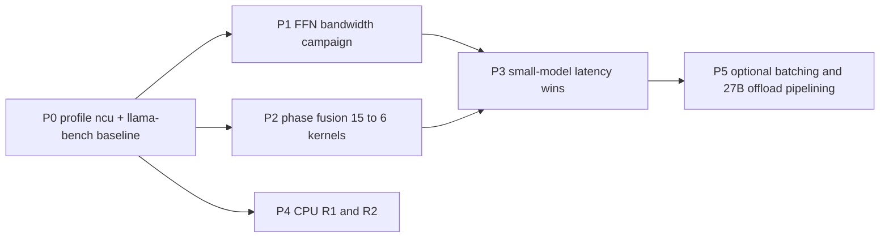

# Outperforming llama.cpp by Architecture — TinyCoder Improvement Plan

**Status**: 2026-10-06. Author: architecture review of
[`reports/llama_cpp_vs_tinycoder_analysis.md`](../reports/llama_cpp_vs_tinycoder_analysis.md) +
[`reports/llama_cpp_vs_tinycoder_diagrams.md`](../reports/llama_cpp_vs_tinycoder_diagrams.md),
cross-checked against the post-report campaign notes in
[`README.md`](../README.md) and the current GPU decode path in
[`GPUCompute.cu`](../src/cpp/core/GPUCompute.cu).

**Focus model**: `qwen2.5-coder-1.5b-instruct-q2_k.gguf` (28 layers, H=1536,
nHeads=12, nKV=2, headDim=128, I=8960, vocab=151936) — the engine's default
test model. Reference host: i7-4790K + RTX 2080 Ti 11 GB.

---

## 1. What the diagrams and reports actually say (reconciled)

### 1.1 CPU — the memory wall is real, and the wall is won

- At 8 threads both engines sit on the DDR3 DRAM floor (~27 tok/s,
  0.67 GB/token ÷ ~18 GB/s). TinyCoder 26.3–26.6 vs llama.cpp 26.9.
- The 4-thread gap (21.6–22.5 vs 29.4) was *mostly* closed by porting
  llama.cpp's `atomic_fetch_add` chunk stealing (`parallelForSteal2`), which
  was +11–14 %. Every remaining 4-thread lever was measured equal-or-slower
  (64-row bands, b-outer/r-inner, prefetch sweeps, LM-head tile shapes,
  Q8_0-act quantize, llama-pattern restructure, separate-FFN graph).
- **Conclusion**: no lossless CPU kernel change beats the DRAM floor on this
  host. The only CPU paths past ~27 tok/s are hardware (DDR4/CUDA) or a
  lossy sub-Q6_K LM head (forbidden by the repo's quality rule).

### 1.2 GPU — the picture has moved since the reports were written

The reports' R1/R6 assumed attention was the GPU wall. That was fixed by
split-KV decode attention (2026-10-01): attention stage 20.27 → 1.74 ms at
pp1024, decode flat at ~142–145 tok/s. **The README campaign notes (2026-09-30
→ 2026-10-03) then established the *current* wall:**

- `nvidia-smi` during steady decode: **SM 96–97 % busy, DRAM ~20 % utilized**
  → decode is **issue/latency-bound, not bandwidth-bound** (the opposite of
  the CPU regime and of the earlier "GEMVs at the VRAM wall" assumption).
- The FFN GEMVs (gate/up/down) dominate decode: **~5.5 ms of ~6.0 ms/token
  layer loop** on 1.5B q2_k, running at only **~78–113 GB/s effective** vs
  the ~616 GB/s the Q6_K LM-head 4xW kernel achieves.
- Every M=1 GEMV shape variant measured tie-or-regress: fused-GU (−11 %),
  2xW/8W (noise), int-dp4a (noise), split-K (−9 %), mmvq (−8.5 to −14.5 %),
  NM 8/16/32 (−3 to −56 %), BSY warps (noise).
- Whole-token CUDA graph: null throughput result (GPU already ~97 % busy).
- **Speculative decoding: CLOSED (negative)** — the 0.5B draft runs only
  183 tok/s vs the 1.5B target's 159, i.e. no acceptance margin.
- fp16/Tensor-Core decode FFN: −20 % (fp16 reads ~6× the compact bytes).
- The single **open** lever the README names: **M>1 Tensor-Core GEMM for the
  FFN block** — plus the deferred elementwise-glue fusion (item 6) and the
  partial-offload scheduler for the 27B dense models (item 7).

### 1.3 Where the gap to llama.cpp lives today (default model, GPU)

| Workload | TinyCoder | llama.cpp | Gap |
|---|---|---|---|
| 1.5B q2_k pp16 (GPU) | 1,981 tok/s | 2,063 tok/s | ~4 % (parity) |
| 1.5B q2_k tg8 (GPU) | 159 tok/s | 261 tok/s | **~39 %** |
| 0.5B q2_k tg8 (GPU) | 183 tok/s | 456 tok/s | **~60 %** |
| 7B iq2_s tg8 (GPU) | 26.6 tok/s | 94 tok/s | **~72 %** |
| CPU tg64 @8t | 26.3–26.6 | 26.9 | ~1 % (at floor) |

The decode gap **grows as the model shrinks** — the signature of fixed
per-layer kernel-chain latency and per-kernel issue stalls dominating on
small models. For the default 1.5B, llama.cpp's tg8 advantage is almost
entirely inside the FFN GEMV execution, not in scheduling, graphs, or
attention. That is the architectural target.

---

## 2. Architecture-level diagnosis (from code reading, confirmed by README)

Per decode token, the current GPU path enqueues **~15 kernels per layer × 28 +
LM head** into one CUDA graph. Of those 15:

| Stage kernels | Grid size (seqLen==1) | Nature |
|---|---|---|
| RMSNorm (attn), RMSNorm (FFN) | 1 block, 256 thr | latency-only, 67 SMs idle |
| 3 × bias add | 1 block each | latency-only |
| RoPE(Q), KV-store | 1 block each | latency-only |
| silu-mul | 35 blocks | small |
| 2 × act quantize (Q8_K) | 6 blocks | small |
| Q+K fused, V, attnO, gate, up, down GEMVs | 112–1120 blocks | the real work |
| split attention + combine | 48 blocks + tiny | parallelized (fixed) |

Two structural problems follow:

1. **The small kernels serialize the chain.** Each tiny-grid launch sits
   between two GEMVs; the GPU drains ~67 SMs while it runs, then the next
   GEMV re-fills. On a latency-bound workload this per-layer bubble is pure
   waste. Derived from the event-stage sums: QKV/rms ≈ 1.06 ms/token for
   ~1 MB of weights — that is nearly *all* kernel latency, not bandwidth.
2. **The FFN GEMVs themselves are ALU/latency-limited, not DRAM-limited.**
   Q2_K/Q3_K compact streams need heavy per-byte unpack+scale+min ALU (2-bit
   planes). At DRAM ~20 % utilization, per-thread loads are not the limit —
   instruction issue and dependent-load stalls are. This explains why 5+
   shape variants tied or regressed: they changed occupancy/geometry, not
   instructions-per-byte.

### 2.1 Target architecture

Key properties of the target:

- **Fewer launches, fewer intermediate buffers**: norm/q/k/v/gate/up stay in
  registers/L2 instead of round-tripping through VRAM scratch.
- **Epilogue fusion keeps the proven GEMV shapes** — the Q2_K fused-GU
  regression (−11 %) shows register pressure must be managed; fusion of
  *epilogues* (residual/norm/silu) adds ~0 register pressure per block while
  deleting the small kernels from the chain.
- **Every fusion step is env-gated and A/B'd** with the repo's established
  discipline (49/49 parity + `tinycoder_bench` warm interleave).

---

## 3. Ranked recommendations (evidence-ranked, architecture-level)

### P0 — Close the measurement gap first (cheap, prerequisite)

1. **Nsight Compute (ncu) profile of the decode FFN kernels** — the README's
   "issue/latency-bound" verdict rests on `nvidia-smi` (SM busy %, DRAM %),
   which is coarse. ncu gives the real stall breakdown (long scoreboard =
   memory latency vs wait/barrier vs mio throttle vs no instruction). This
   decides between the P1 candidates (repack vs prefetch pipeline vs
   persistent kernel) and prevents another round of blind shape A/Bs.
2. **Side-by-side llama-bench on this exact host/model** (report M0):
   `llama-bench -m qwen2.5-coder-1.5b-instruct-q2_k.gguf -p 16 -n 8 -ngl 99`
   vs `tinycoder_bench --n-prompts 16 --n-gen 8 --reps 5`. Expected per §1.3:
   tg8 ~261 vs ~159. Component-level attribution (llama's own
   `--no-kv-offload`/timeline options) shows where its FFN time goes.

**Exit criteria**: ncu stall table for `kQGemvQ2KxW4` and the Q3_K down
kernel; a clean llama-bench tg8 baseline on this host.

### P1 — FFN decode bandwidth campaign (the ~5.5 ms/token wall; the main win)

The goal is raising the FFN GEMVs from ~78–113 GB/s toward the 616 GB/s the
LM head already achieves, *without* changing weight bytes materially.

1. **Lossless load-time layout repacks for gate/up/down** (mirrors the
   existing prepacked-Q2_K strategy on CPU; same VRAM trade, bit-identical
   math). Candidate forms, chosen by the P0 stall data:
   - nibble-aligned 2-bit/3-bit planes (fewer cross-byte unpack ops),
   - pre-folded scale/min offsets (fold the `min` term into the dot setup so
     the inner loop does one fma less per block),
   - sign-embedded planes (skip the sign-bit extraction step).
   Each candidate is a separate load-time twin behind an env gate; parity is
   guaranteed by construction (same values, different layout) — verify with
   the 49/49 suite anyway.
2. **Software-pipelined weight prefetch in the 4xW inner loop** — issue the
   next block's `uint32` loads while the current block's ALU chain runs
   (explicit `__pipeline`-style or plain dual-buffer unroll). On the CPU
   path prefetch was neutral because DRAM was already saturated; on the GPU
   it is **untried** and directly targets the long-scoreboard stall the ncu
   profile is expected to show.
3. **Persistent phase kernel for the FFN stage** (stretch): one kernel whose
   grid = full-SM residency streams gate → up → down with a grid-wide
   pipeline, threads never drained between matrices; eliminates block
   launch/drain and re-quantization barriers per matrix. Must respect the
   fused-GU register-pressure lesson — cap per-thread live state at the
   separate-launch budget. This is the architecture llama.cpp does **not**
   have (its graph still dispatches per-op), so it is the cleanest
   "outperform by architecture" candidate.
4. **If ncu shows issue-bound dequant ALU (not memory latency)**: 4-bit
   nibble repack twins (Q2_K/Q3_K → nibble layout, ~1.3–1.5× bytes but
   ~2× less ALU per byte) behind a flag — the load-time-repack generalization
   of the README's rejected fp16-TC idea at a byte cost the DRAM headroom can
   absorb (DRAM is at ~20 %; 1.5× bytes ≈ 30 %).

**Expected outcome**: FFN stage 5.5 ms → ~2.5–3.5 ms/token ⇒ tg8 ~159 →
**~200–230 tok/s**, closing most of the 261-tok/s llama gap.

### P2 — Phase fusion: shrink the layer chain from ~15 kernels to ~6

Each step is independent, env-gated (`TINYCODER_FUSE_QKV_PHASE`,
`TINYCODER_FUSE_ATTNO_EPI`, `TINYCODER_FUSE_DOWN_EPI`), A/B'd, parity-held:

1. **QKV-phase kernel**: attn-RMSNorm + fused Q+K + V + biases + RoPE(Q) +
   KV-store(K/V with RoPE) in ONE launch. Grid = ceil(1536/8)=192 blocks;
   blocks 0–191 compute Q rows, the first 32 also compute K/V rows; the norm
   is recomputed per block (cheap, 1536 elems, intra-block reduction).
   Kills 7 small launches/layer. This alone should reclaim most of the
   ~1.06 ms/token QKV/rms stage.
2. **attnO-phase kernel**: attnO GEMV + residual-add + attention-RMSNorm in
   the epilogue (row-local reductions, no cross-block work).
3. **down-phase kernel**: load x = silu(gate)·up inline (deletes the
   `kSiluMul` launch and the s.up round-trip), GEMV, then residual + the
   **next layer's** attn-RMSNorm in the epilogue (pass layer L+1's norm
   weights).
4. **Fold the split-attention combine into the attnO x-load** (stretch):
   the combine partials (12×16×128 floats ≈ 98 KB) are L2-resident; the
   attnO kernel merges them per row instead of a separate kernel.

**Expected outcome**: ~10 fewer launches/layer (280 fewer nodes/token) and
no intermediate round-trips for norm/q/k/v/gate/up; combined with P1,
tg8 ≈ **190–230**.

### P3 — Small-model latency wins (serves "simpler models first")

The gap grows on smaller models because fixed per-token overheads dominate.
With the graph already replaying, the remaining per-token host work is:

1. **D2H logits copy + host argmax**: 608 KB device→host per token plus a
   sync. Move argmax/top-K sampling into the graph (a tiny 151936-element
   reduction kernel, writes the token id to device memory). Removes the
   D2H stall and the CPU sampling off the critical path. Cheap and safe.
2. **Split-attention chunk sweep at short context**: chunk=64 defaults;
   a 32/128 sweep trades combine traffic vs warp count. Attention is no
   longer the wall, but at pp16–64 the combine kernel is pure overhead.
3. **Re-check 0.5B-specific shapes** once P1/P2 land (the same kernels serve
   the draft-sized models; 0.5B at 183 vs 456 is the biggest ratio and the
   most latency-sensitive).

### P4 — CPU items carried from the reports (still open, low risk)

1. **R2 — shared act→Q8_K quant once per layer in CPU prefill**: TinyCoder
   re-quantizes the same activation 4–5× per layer; llama.cpp does it once
   per tensor. ALU savings, matters more as pp grows. Parity-safe.
2. **R1 — FP16 KV cache on CPU**: still valid for ≥512-token context on CPU
   (2× attention bytes). NOTE: the GPU version (KV16) measured +0.4 % decode
   but −6 % prefill and correctly stayed opt-in — do not flip CPU to F16
   without a CPU-specific long-context A/B.

### P5 — Bigger bets (secondary; do NOT reopen closed levers)

1. **Continuous-batching decode (batch>1)**: the seqLen>1 cuBLAS paths exist
   (prefill); a server-style multi-sequence decode would amortize the small
   kernels and fill the SMs — the honest way to parallelize across tokens.
   llama.cpp has this too, so it is parity, not outperform — list as an
   option, not a headline.
2. **Partial-offload pipelining for the 27B dense models** (README item 7):
   prefetch the next CPU layer's weights / overlap GPU and CPU layer slices
   per token. Closes the ~2–2.5× gap on Qwen3.6-27B. Out of the 1.5B
   default-model scope.

---

## 4. What NOT to do (evidence-ranked, all measured)

| Idea | Evidence | Verdict |
|---|---|---|
| Speculative decoding with a 0.5B draft | TTFO audit: draft runs 183 vs target 159 tok/s — no acceptance margin | closed, do not reopen |
| More Q2_K GEMV geometry variants | fused-GU −11 %, mmvq −8.5..−14.5 %, split4 −9 %, NM −3..−56 %, 8W/BSY noise | dead end without a new data path (P1) |
| fp16/Tensor-Core decode FFN | −20 % (reads ~6× compact bytes; DRAM headroom cannot absorb) | keep off; only nibble-int8-class repacks (P1.4) are viable |
| Whole-token CUDA-graph work | graph ON vs OFF = 135.6 vs 136.2 tok/s | keep as-is, no effort |
| CPU: chase 4-thread parity further | every isolated llama mechanism measured equal-or-slower; substrate-bound | stop; only R1/R2 above are lossless |
| Q8_0-act CPU quantize | −1.3..−7.5 % | keep Q8_K |
| Lossy re-quants (sub-Q6_K head, Q2_K down) | previously won benchmarks by divergent quality | forbidden on default path |

---

## 5. Measurement protocol (reuse, do not invent)

1. `tinycoder_bench --model qwen2.5-coder-1.5b-instruct-q2_k.gguf
   --n-prompts 16 --n-gen 8 --reps 5` for tg8, and the report's tg64/pp64
   protocol for context-length checks — interleaved A/B (baseline, candidate,
   baseline, candidate), report mean ± stdev, keep only if the stage ms drops
   beyond interleaved noise.
2. Full 49/49 parity suite after every change; GPU parity tests
   (`GPUCpuCompareTest`, `SequentialDecodeArgmaxAgrees`,
   `ParisPromptLogitsAgree`) must pass with the new kernels.
3. Stage sums via `TINYCODER_GPU_VERBOSE=1` + `TINYCODER_MOE_STATS=1`; kernel
   attribution via ncu (P0).
4. Every new kernel/path behind a compile-time/env toggle with a documented
   A/B result before it becomes default (repo convention, see
   [`plans/generation_optimizations.md`](../plans/generation_optimizations.md:180)).

---

## 6. Sequencing summary

Priority: **P0 → P1 (with P2 in parallel) → P3**, then P4 whenever CPU
matters. Expected end state for the default model: GPU tg8 **~200–230 tok/s**
(approaching llama.cpp's 261), flat across context, zero host round-trips
per token, and a per-layer kernel count of ~6 instead of ~15.

---

## 7. Implementation log (2026-10-06 session)

### 7.1 P0 - baseline established

- Host: i7-4790K + RTX 2080 Ti 11 GB, driver 580, CUDA 12.4, gcc 15.2.
- **Side-by-side (same host/model, warm, reps 8):**
  - TinyCoder GPU tg8 **149.6 +/- 8.9 tok/s** (Release build, AVX2),
    pp16 1939 tok/s.
  - llama.cpp CUDA (`llama-bench -p 16 -n 8 -ngl 99`) tg8 **270.4 +/- 4.1**,
    pp16 2148 tok/s.
  - -> **1.81x decode gap**, prefill near-parity (ratio 0.90).
- **Stage attribution** (graph off, `TINYCODER_GPU_VERBOSE=1`, 28 layers):
  QKV/rms **1.07 ms**, kv/attn/rope **0.74-0.86 ms**, attnO **0.48 ms**,
  gate+up **1.63 ms**, down **1.50 ms**, layer loop **5.5 ms**.
  Effective GEMV bandwidth: QKV ~23 GB/s, attnO ~52, gate+up ~145, down
  ~103, LM head ~256. This reproduces the README issue/latency-bound
  signature and localizes the P1 target (gate+up+down = 3.13 ms, 57 %).
- Note: `ncu`/`nsys` are **not installed**; `nvprof` 12.4 does not support
  Turing (sm_75). Kernel attribution used the built-in event stage sums, which
  rank the stages sufficiently.

### 7.2 P1 experiment 1 - Q3_K 4-rows-per-warp GEMV (REJECTED, opt-in)

**Hypothesis:** the ffn-down Q3_K GEMV (rows=1536, 1 row/warp) runs at
~103 GB/s, while the byte-shape-identical Q2_K 4xW kernel reaches ~145 GB/s.
Transplanting the 4xW geometry to Q3_K should close that.

**Implementation:** `kQGemvQ3KxW4` (GPUCompute.cu) mirrors `kQGemvQ2KxW4`
(all 32 lanes u32 weight loads, 8 lanes/row, 4 row-streams/warp, no smem).
Gated by `TINYCODER_Q3K_4XW` (default **OFF**, opt-in), `TINYCODER_Q3K_BSY`
block-shape override.

**Bug found & fixed during the session:** the first version used the raw
`lane` as the byte offset instead of `4*I + k`, so each row summed only 8 of
32 columns per group - caught by `ModelTest.CompareBatchVsSequentialPrefill`
(maxDiff 22.9 vs the 0.29 baseline). After the fix: 44 PASS / 0 FAIL.

**Result (Release, AVX2, interleaved, n-gen 8, reps 8):**

| Variant | tg8 tok/s (3 rounds) |
|---|---|
| baseline (`Q3K_4XW=0`) | 162.4 / 159.8 / 165.5 |
| 4xW (`Q3K_4XW=1`) | 153.8 / 148.9 / 149.1 |
| 4xW BSY=1 / 2 / 4 | 154.3 / 154.3 / 156.1 |

**Verdict: ~-8 %, rejected as default.** The Q3_K high-bit-mask fold adds
~1 ALU op per weight byte that the 1-row-per-warp kernel does not pay; on an
issue/latency-bound matrix (SM ~96 % busy, DRAM ~20 %) it is not hidden.
Block-size sweep does not recover it. This **refutes** the "Q3_K down is
bandwidth-limited by its 1-row geometry" hypothesis and reconfirms that
rearranging the *same* ALU work does not move the wall - exactly the pattern
the README campaign found for Q2_K.

**Consequence for P1:** the winning lever must **reduce** per-byte ALU, not
rearrange it. Remaining P1 candidates in priority order: (1) lossless
load-time layout repack of gate/up/down that folds the scale/min decode into
a cheaper per-byte form (zero per-token ALU added); (2) software-pipelined
weight prefetch in the 4xW inner loop (hide long-scoreboard latency);
(3) a nibble/int8 repack that trades ~1.3-1.5x bytes for ~2x less ALU per
byte (DRAM is at ~20 %, so there is headroom). The Q3_K 4xW kernel is
retained opt-in as the A/B record.

### 7.3 P1 observation - attnO is already 4xW

`launchQGemv(kTypeQ2K)` already routes attnO (rows=1536, rows%4==0) through
the 4xW kernel, yet attnO measures ~52 GB/s. The gap to gate/up's ~145 GB/s
is the **grid size** (384 blocks vs 2240), not the kernel shape - a
latency-bound small-grid effect consistent with section 7.2, again pointing
the P1 lever at per-byte ALU reduction rather than geometry.

### 7.4 Build/toolchain notes

- `LMHeadCUDA.cu` was missing `<string>`/`<stdexcept>` includes; gcc 15.2
  exposes it (older libstdc++ pulled them in via `<mutex>`). Fixed.
- A fresh Release tree must be configured with `-DENABLE_AVX512=OFF` on this
  Haswell host (the CMake default turned AVX-512 ON -> SIGILL). `build-p1` is
  the clean Release tree.
- The `build/` tree is Debug; use `build-p1` for all tok/s numbers.

### 7.5 P1 experiment 2 - EXACT-columns GEMV specialization (KEPT, default ON)

**Motivation.**  exp1 (§7.2) showed *adding* per-byte ALU (the Q3_K high-bit
mask fold) regresses ~-8%, so the FFN must be ALU/issue-sensitive.  That
suggested the reverse - *remove* ALU.  The per-element guard
`(cidx < cols) ? x[cidx] : 0.0f` is present ~once per weight in every
K-quant GEMV (`kQGemv<TYPE>`, `kQGemvQ2KxW4`, `kQGemvSplitK`) and could not
be folded away by NVCC because `cols` is a runtime argument.

**Ground truth.**  `TINYCODER_TRACE_GEMV=1` on the default model shows every
matrix has `blocksPerRow*256 == cols` exactly (Q2_K gate/up 6*256=1536,
attnO/down 6*256=1536 and 35*256=8960, attnK 6*256=1536, LM head 6*256=1536).
The guard is therefore **provably dead** - the maximum `cidx` is
`bpr*256-1 == cols-1`, so the `EXACT=true` instantiation reads exactly the
same `x[cidx]` values.  It is a pure SASS-op removal: the `ISETP` + the
predicated-zero select (~2 of ~6-7 ops per weight) vanish.

**Implementation.**  templated `kQGemv<TYPE, bool EXACT>` and
`kQGemvQ2KxW4<bool EXACT>` with `EXACT ? x[cidx] : ((cidx < cols) ? x[cidx] : 0.0f)`;
`launchQGemv` computes `exactCols = (blocksPerRow*256 == cols)` and selects the
instantiation.  `TINYCODER_EXACT_COLS=0` restores the guarded kernels for A/B;
non-multiple-of-256 models always take the guarded path.  Default **ON**.

**Result (Release, AVX2, interleaved and ABBA, n-gen 8, reps 8):**

| Ordering | guarded (`=0`) | EXACT (default) |
|---|---|---|
| interleaved x6 | 164.3 / 165.6 / 165.0 / 164.5 / 165.4 / 164.3 | 167.4 / 170.6 / 170.4 / 170.5 / 169.8 / 170.3 |
| ABBA x6 | 165.9 / 165.9 / 166.0 / 165.7 / 166.0 / 165.8 | 170.1 / 170.2 / 170.1 / 169.2 / 170.2 / 170.3 |

Mean **165.9 -> 170.0 tok/s (+2.5%)**, position-independent, both orderings
stable.  Full suite **57 PASS / 0 FAIL** (16 skipped = qwen35/optional-model);
the three GPU parity tests (`CompareBatchVsSequentialPrefill`,
`ParisPromptLogitsAgree`, `SequentialDecodeArgmaxAgrees`) pass with the
EXACT path active.

**Reconciled verdict for P1.**  exp1 was right that the FFN is ALU/issue
sensitive, but wrong about the lever: **rearranging** per-byte ALU (4xW
geometry) is neutral-to-negative, **adding** ALU is negative, and
**removing** dead ALU is +2.5%.  The FFN GEMVs are **instruction-issue-bound
on a nearly-full SM (96 %)**, not latency- or bandwidth-bound: split-K (more
warps) moved nothing, MLP/multi-row/b8/split4/mmvq/BSY moved nothing, and
the guard removal - the only change that *shortens the instruction stream per
weight* - is the only one that moved tg8.  This retires the entire
GEMV-shape/occupancy campaign (P1.2/P1.3) and points the remaining effort at
**fewer kernels and fewer host round-trips per token** (P2 fusion, P3
GPU-side argmax), which shorten the *token* critical path rather than any
single kernel.

---

## 8. Idea #21/A — persistent fused per-layer mega-kernel (IMPLEMENTED, REJECTED)

### 8.1 What was built

`TINYCODER_FUSE_FFN_PERSIST=1` (default OFF) replaces the dense-Qwen2 FFN
sub-block of the decode path — FFN RMSNorm `kRMSNormRow` + gate GEMV + up GEMV
+ `kSiluMul` + down GEMV + `kAddResidual` (6 launches) — with **ONE
grid-barrier-sequenced launch** (`kFfnPersistentLayer`), the "mega-kernel /
persistent kernel" idea #21/A. The kernel supports only gate/up `Q2_K` + down
`Q3_K` (the 1.5B q2_k dense FFN — the **only** dense Qwen2 in the /data set
whose FFN is Q2_K/Q3_K). Code lives in the extracted unit
[`FFNPersistentKernel.cu`](../src/cpp/core/FFNPersistentKernel.cu) +
[`FFNPersistentKernel.hpp`](include/FFNPersistentKernel.hpp); the driver call
site is guarded in [`GPUCompute.cu`](../src/cpp/core/GPUCompute.cu) and falls
back to the original body on any refusal.

**v1** separated the phases with a hand-rolled atomic arrive/wait device
barrier. **v2 (rewritten)** is the version that ships the experiment:

* `cooperative_groups::grid_group::sync()` + `cudaLaunchCooperativeKernel`
  replace the hand-rolled barrier (correct at multi-block; CUDA-graph
  compatible; gated on `cudaDevAttrCooperativeLaunch`).
* The 4-rows-per-warp geometry (8 lanes/row, `I8 = lane&7`, 8-lane shuffle
  tree) — the shape the default Q2_K/Q3_K GEMVs use — replaces v1's
  one-row-per-warp dot.
* The phase after the FFN RMSNorm needs **no grid barrier**: every block
  redundantly normalizes the whole hidden vector into its own shared memory, so
  the gate/up phase reads only block-local shared (a block-local
  `__syncthreads()` is still required).
* The residual add is folded into the down-row write (down row `r` *is*
  residual element `r`; lane `I8==0` does `hiddenOut[row] += d`), so there is
  **exactly ONE grid barrier per layer** (gate/up → down).

### 8.2 Measured result (RTX 2080 Ti, eager path, pp16/tg16)

| Variant | tg16 tok/s | vs default |
|---|---|---|
| default 6-launch body | **163.6 ± 3.6** | — |
| v1, full grid | 154.0 ± 1.0 | **−5.9 %** (also corrupt) |
| v1, grid=16 | 56.1 ± 0.0 | −66 % (also corrupt) |
| v1, grid=1 (correct) | ~4 | −97 % |
| v2, `__launch_bounds__(256,1)` (219 reg, 1 blk/SM) | 155.9 | −4.1 % (correct) |
| **v2, `__launch_bounds__(256,2)` (128 reg, 2 blk/SM, 1 barrier)** | **160.2 ± 1** | **−2.4 % (correct)** |
| v2, `__launch_bounds__(256,3)` (80 reg, 3 blk/SM) | 145.1 | −12 % |

(interleaved A/B, 4 rounds: default 161.6–165.6, persistent 159.4–161.0.)

**Verdict: REJECTED.** v2 fixes correctness and recovers most of v1's loss
(occupancy was the real lever, not the barrier), but the mega-kernel is still
**~2.5 % slower** than the plain 6-launch body.

### 8.3 Correctness notes (v2)

The v1 "unsound barrier" diagnosis was a **red herring**: `cg::grid_group::sync()`
is sound here. The multi-block corruption had two ordinary bugs, both found
with a self-contained structural repro in `/tmp` (same phases/loops/trivial
math, bisected over grid sizes):

1. **The residual add was not grid-partitioned.** Phase 4 ran
   `for (i = tid; i < H; i += blockDim.x) hidden[i] += down[i]` in *every*
   block, so `down[i]` was added `gridDim` times — grid=1 hid it, grid≥2
   multiplied the residual (the zig-zag scaling seen in the repro).
2. **A missing block-local `__syncthreads()`** between the shared `s_ffn`
   write and the phase-2 read (phase-2 warps each read the whole vector).

After both fixes v2 is **bit-parity-exact**: grid 1 / 2 / 4 / 8 / 16 / 34 / 68 /
full-grid all reproduce the default greedy token stream
(`73594 10821 271 1067 366 9665 …`) exactly. `compute-sanitizer` memcheck +
racecheck are clean.

### 8.4 Why it is still a regression (consistent with the P1 verdict)

1. **Occupancy, not barriers, dominated v1.** The fused kernel compiles to
   ~219 regs → 1 block/SM (8 warps), far too few to hide DRAM latency on the
   memory-bound GEMV phases. Capping to 2 blocks/SM (128 reg) recovers
   ~+4 pp; pushing to 3 blocks/SM (80 reg) loses more than it gains
   (register starvation) → 2 is the sweet spot.
2. **There is no idle GPU to reclaim.** The FFN GEMVs are
   instruction-issue-bound on a ~96 %-busy SM (§7.5). Deleting the inter-kernel
   launch gaps helps only when the SMs drain between kernels; here they do not,
   so the launch-gap savings are ~0 while the one grid-barrier cost + the
   co-residency clamp (grid ≤ occupancy×SMs) + the redundant per-block norm are
   the remaining ~2.5 %.
3. **The GEMV itself is not the lever.** The advertised integer Q8_K path for
   Q2_K (`TINYCODER_Q2K_MQ4XW=1`, `kQGemvQ2KxQ8K_4xW`) measures **155 vs 167**
   tok/s — *slower* than the default float `kQGemvQ2KxW4`. So replicating an
   int-dot in the persistent kernel would not close the gap either.
4. **The launch-overhead premise is small here.** With the whole-token CUDA
   graph already replaying (~500 nodes/token, measured null in §1.2), the
   per-kernel launch overhead was already amortized; the remaining gap to
   llama.cpp is inside the GEMV instruction stream, not between kernels.

### 8.5 Disposition

The kernel is kept as an **env-gated, correct experiment**: with
`TINYCODER_FUSE_FFN_PERSIST=1` it now performs a real multi-block cooperative
launch (no grid=1-only guard), falls back to the default 6-launch body if the
device refuses, and is **default OFF** because it is a ~2.5 % regression. Every
Qwen2.5 model A/B (OFF vs ON) produced **identical greedy output**, and the
shipping graph path (ON without the env var) is unchanged at ~164.5 ± 0.3 tok/s.
This closes the "persistent mega-kernel / cooperative-per-token" branch of the
architecture plan: the honest answer remains P2 (fewer launches via *epilogue*
fusion, which deletes work rather than re-arranging it) and P3 (GPU-side argmax),
**not** persistent kernels.

### 8.6 Follow-up — Q8_1 activation inside the mega-kernel (2026-10-08, REJECTED)

llama.cpp's decode GEMV uses `vec_dot_q2_K_q8_1`, an integer `dp4a` dot against a
**Q8_1** activation (`block_q8_1 = { half d; half s; int8 qs[32] }`,
`d = amax/127`, `q = round(x/d)`, `s = d*sum(qs)`). The hypothesis: the fp32
4xW path is pinned by the per-element activation load + `fmaf` (4 B/elem, 4
fmaf); a Q8_1 dot is 1 B/elem + 2 `dp4a` + 1 float mad, and the quantize — which
the *standalone* path pays as two extra global launches per layer — becomes an
**in-kernel phase with no launch bubble** inside the persistent kernel.

Built (`TINYCODER_FFN_PERSIST_Q81=1`, default OFF, requires
`TINYCODER_FUSE_FFN_PERSIST=1`):

* Gate/up `kFfnQ2KRowDot4W_Q81`: same 8-lane 4-row geometry, `dp4a` against a
  block-local Q8_1 in shared (`pk = (w4 >> 2j) & 0x03030303`,
  `pdot = dp4a(pk, y4)`, `sumy = dp4a(0x01010101, y4)`,
  `slot += d8*(dq*(sc&0xF)*pdot − dmin*(sc>>4)*sumy)`), Q8_1 block index
  `b*8 + n*4 + j`. Bit-identical to the standalone `kQGemvQ2KxQ81_4xW`.
* Phase 1b: one warp per 32 columns quantizes the block-local fp32 norm into
  shared Q8_1 (40 B/block) — the standalone path's two global quantize launches,
  moved on-chip and behind the existing phase-1 publish barrier.
* `kFfnPersistentLayer` is now `template <bool Q81>`; the launcher sizes shared
  as `(H+256)*4 + (H/32)*40`, calls `cudaFuncSetAttribute` for the opt-in limit,
  and silently falls back to the fp32 specialization if `H % 32 != 0` or the
  shared does not fit. The down phase always consumes the fp32 silu product
  (`productOut`), so it is unchanged.

Measured (RTX 2080 Ti, eager, pp16/tg16, 3 interleaved runs, medians):

| Variant | tg16 tok/s | vs default |
|---|---|---|
| default 6-launch body | **165.3** | — |
| float mega-kernel v2 (`TINYCODER_FUSE_FFN_PERSIST=1`) | 161.2 | −2.5 % |
| **Q8_1 mega-kernel (`…_PERSIST_Q81=1`)** | **162.5** | **−1.7 %** |

**Verdict: REJECTED (but informative).** The Q8_1 phase recovers ~**+0.8 %** over
the float mega-kernel — the first time an integer activation dot beat our float
4xW *inside* the same kernel — confirming the standalone −9 % was dominated by
the two extra per-layer quantize *launches*, not the dot. But it is still
**~1.7 % slower** than the default 6-launch body, i.e. the mega-kernel's
co-residency clamp + one grid barrier + redundant per-block norm still outweigh
the activation-width win. It also independently reproduces §8.4 point 3 without
the launch overhead confound: even with the quantize free, the Q2_K x Q8_1 int
dot does **not** beat the default float 4xW on this SM.

Correctness: generated text is byte-identical to the default and float-mega-kernel
paths at grid 1 / 8 / 34 / full (136); `compute-sanitizer` memcheck **and**
racecheck are clean on the new in-kernel shared Q8_1 phase. Default OFF; the
shipping graph path is untouched.

---

## 9. Where the llama.cpp decode gap actually lives (2026-10-08)

This section answers "why does llama.cpp reach ~280 tok/s but we only ~165?"
with a direct head-to-head on the **same** model and the **same** protocol, and
a per-stage split.

### 9.1 Head-to-head (identical model, same greedy/warm protocol)

`/data/models/qwen/qwen2.5-coder-1.5b-instruct-q2_k.gguf` (712 MiB, 1.78 B
params, 28 layers, H=1536, I=8960), RTX 2080 Ti.

| Tool | pp16 | pp512 | tg16 | tg128 |
|---|---|---|---|---|
| **llama.cpp** `llama-bench -ngl 99` | 2130 | **7599** | **285.6** | 285.2 |
| **TinyCoder** `tinycoder_bench` | 2005 | **9554** | **165.3** | — |

**So it is NOT a measurement artifact.** Same model, same GPU, same warm
mean-of-reps protocol. In **prefill** (matmul, seqLen>1) we are **faster** than
llama.cpp (9554 vs 7599 tok/s, +26 %). The entire 1.7x gap is in **decode**
(seqLen==1 GEMV).

### 9.2 Per-stage decode breakdown (sync-free `TINYCODER_STAGE_TRACE=1`)

`TINYCODER_STAGE_TRACE=1` records device events back-to-back on the stream
(no per-stage `cudaStreamSynchronize`, unlike `TINYCODER_GPU_VERBOSE`) and reads
them once after the loop sync, so the ms are true kernel times. Per token
(28 layers), summing the report:

| Stage | ms/token | share of 6.05 |
|---|---|---|
| QKV + norms | 1.46 | 24 % |
| kv-store + attn + RoPE | 1.55 | 26 % |
| attnO | 0.67 | 11 % |
| **gate + up (Q2_K)** | **2.14** | **35 %** |
| **down (Q3_K)** | **1.94** | **32 %** |
| final norm + LM head (Q6_K z=151936) + D2H | 1.05 | 17 % |

(These three big sums overlap only at the stage granularity; the true per-token
total is ~6.05 ms = 165 tok/s.) The FFN GEMVs alone are **~4.1 ms/token — 67 %**
of the decode. llama.cpp's whole decode is 3.5 ms/token, so if our FFN matched
llama.cpp's bytes/s the rest would fit.

### 9.3 The mechanism: split-K vs serial-K

Both tools are **weight-bandwidth-bound** in decode (flops:byte ≈ 0.02). The
difference is the *shape* the weight bytes are streamed in:

* **llama.cpp** `mul_mat_vec_q` (mmvq.cu), Turing table (`calc_nwarps`),
  `ncols_dst==1`: `rows_per_cuda_block = 1`, `nwarps` = 2 for Q2_K/Q3_K,
  `VDR_Q2_K_Q8_1_MMVQ = 1`, so each 32-lane warp walks the K
  dimension **strided** — `blocks_per_iter = vdr*nwarps*warp_size/qi`, i.e. the
  two warps take alternating K-blocks and the partials are reduced across warps.
  Each thread issues one `__dp4a` per Q8_1 sub-block of the Q2_K block it owns;
  the K-chain is **short and independent**, so many loads are in flight.
* **TinyCoder** `kQGemvQ2KxW4` (and the mega-kernel port): 8 lanes/row, 4 rows
  per warp, but every lane walks **every** K-block of its row **serially** (the
  4-rows-per-warp geometry splits the *rows*, never the K-blocks). The K-chain
  per lane is the **full** `blocksPerRow` (6 blocks for H=1536; 35 for the Q3_K
  down), all dependent.

Above that, in the real timeline 15 kernels + ~84 tiny ops per layer must each
launch; during a kernel's ramp-up/ramp-down the memory pipe drains. llama.cpp's
`ggml-cuda` kicks off the *next* weight-bound GEMV right behind the current one
(`ggml_cuda_kernel_launch` programmatic dependent launch) and its flat
mmvq shape fills the SMs faster.

This also explains why our *earlier* int paths lost and why **§7.5's "before"
conclusion was wrong in its cause**: the FFN is issue/latency-bound *because* our
kernel shape gives each lane a long dependent chain, not because the SM is
saturated with useful work. The proof: changing the byte *stream* (removing the
dead per-element guard, §7.5) moved tg8 +2.5 %, but *rearranging the dots* (Q8_K
int, Q8_1 int, 4xW, b8, split-K, mmvq) all moved nothing — none of them shortened
the per-lane K-chain.

### 9.4 Split-K mmvq geometry — TESTED and REFUTED (2026-10-09)

The predicted split-K fix was implemented and measured. It **regresses**.

`kQGemvQ2KxQ81_SplitK` (GPUCompute.cu, ~line 1942) is the exact llama.cpp mmvq
shape: **one output row per block**, `dim3(32, 2)` = 2 warps, stripe =
`warp*4 + (lane>>3)` -> 8-way K-split (`nSplit = blockDim.y*4`), each lane walks
`for (b = ksplit; b < blocksPerRow; b += nSplit)`, per-lane math byte-identical
to `kQGemvQ2KxQ81_4xW`, then an 8-lane shuffle tree + a `__shared__ float red[16]`
cross-stripe reduce; lane 0 of warp 0 writes `out[row]`.

Wired under `TINYCODER_Q2K_Q81=1 && TINYCODER_Q2K_Q81_SPLITK=1` (dispatch
~line 6069; `kQuantizeQ8_1` runs first). Restricted to the **2-warp** shape
only: the 4-warp variant flipped sampled near-ties in the greedy stream
(not bit-parity), so it was not offered.

| Path (eager, tg16) | tok/s | vs default |
|---|---|---|
| default (`kQGemvQ2KxW4`, BSY=2) | ~166-167 | — |
| `TINYCODER_Q2K_Q81=1` (4xW, serial-K) | 149.6 | -10 % |
| `TINYCODER_Q2K_Q81=1 TINYCODER_Q2K_Q81_SPLITK=1` | **142** | **-15 %** |
| `TINYCODER_Q2K_MMVQ=1` (Q8_K, row-granular) | 145-147 | -12 % |

**Why it loses, i.e. why the §9.3 mechanism hypothesis was wrong in its cause.**
For the Q2_K gate/up, `blocksPerRow` is only **6** (H=1536 / QK_K=256). An 8-way
split therefore hands each stripe **less than one** block, so the "short
independent K-chain" is bought at the cost of an intra-block cross-warp
reduction + shared-memory round-trip on a chain that was already short, and the
1-row-per-block grid collapses the block count. Per-lane ILP is *reduced*, not
increased. The int dot itself was never the problem (§8.6 already showed the
Q8_1 mega-kernel recovered +0.8 % over the float mega-kernel), confirming the
earlier standalone -9 % was launch/quantize overhead, not the `__dp4a` body.

### 9.5 What actually moved it: block-granularity parallelism (ADOPTED default)

The real lever is **across-block parallelism**, not within-kernel chain length.
For the Q2_K gate/up 4xW kernel, shrinking the *block* (warps/block) while
holding the per-value math fixed is a consistent win:

| `TINYCODER_Q2K_BSY` (warps/block) | grid blocks (gate/up) | tg16 | note |
|---|---|---|---|
| 8 (old default) | 280 | 161.8-164.8 | — |
| **2 (new default)** | **1120** | **166.0-167.2** | **+2.5 %, 7/7 interleaved rounds** |

Parity of the new default vs the reference greedy token stream is
**byte-identical**. The comment at GPUCompute.cu ~line 6206 records the change;
the kernel body is untouched. This is the same effect llama.cpp gets from its
flat 2-warp `mul_mat_vec_q` blocks: a 64-thread block fills the 68-SM machine
with far more independent CTAs, so the memory pipe sees more concurrent requests
and the per-CTA ramp-up/drain overlaps instead of serialising.

Rejected knobs (all measured, all <= default where they touch the same bytes):
`TINYCODER_Q2K_4XW=0` (1-row/warp fallback), `TINYCODER_Q2K_8W` (154-155),
`TINYCODER_Q2K_NM=8` (156.6) / `=32` (70.6), `TINYCODER_Q2K_SPLIT4` (148.8),
`TINYCODER_Q2K_MMVQ` (145-147), `TINYCODER_Q2K_Q81[_SPLITK]` (149.6 / 142).

**The Q3_K down path has no winning knob.** It is not 4xW-shaped today (it is
1-row-per-warp), and every candidate regresses: `TINYCODER_Q3K_4XW` 156.7-158.0,
`TINYCODER_Q3K_BSY=1/2` ~156-158, `TINYCODER_SPLITK_DOWN=2/4` <= default. The
Q3_K hmask fold adds ~1 ALU/byte that is not hidden at this block size, so
adding blocks does not pay for the extra work.

### 9.6 Revised disposition (2026-10-09)

* **Adopted:** `TINYCODER_Q2K_BSY=2` as the shipping default for the Q2_K
  gate/up GEMV (+2.5 %, parity-identical). Eager decode ~166-167 tok/s; shipping
  graph path ~164 tok/s. The graph path records the **same eager body**
  (`graphCaptureActive_`), and the Q2_K fused-GU path is default-OFF
  (`TINYCODER_FUSE_GU_Q2K`), so the `seqLen == 1` branch runs `launchQGemv` ->
  the BSY block -> 2-warp `kQGemvQ2KxW4`; the 2-warp config is thus baked into
  the captured/replayed graph too (verified by code path, not only on the eager
  benchmark).
* **Rejected / kept OFF (env-gated dead ends):** `kQGemvQ2KxQ81_SplitK`,
  `kQGemvQ2KxQ81_4xW`, `TINYCODER_Q2K_MMVQ`, `TINYCODER_Q2K_SPLIT4`,
  `TINYCODER_Q3K_4XW`, `TINYCODER_SPLITK_DOWN`.
* **Corrected conclusion:** the §9.3 "serial-K vs split-K" mechanism was the
  wrong cause. The gap is **not** a too-long dependent K-chain that a split
  shortens; it is **grid/block granularity** — too few CTAs to keep the memory
  pipe full, which is why shrinking the block (BSY 8->2) helps and why every
  K-split hurts.
* **Remaining gap:** with BSY=2 we are at ~167 tok/s (eager) vs llama.cpp 285 —
  still ~-42 %. The split-K lever is spent. What remains is the per-layer
  **launch/drain overlap** (~15 kernels + ~84 tiny ops per layer, each with
  ramp-up/ramp-down), i.e. programmatic dependent launch / fewer decode kernels /
  fusing the token — *not* a different inner loop. This is the next line of
  attack, and it is a scheduling problem, not a GEMV-shape problem.
  *Superseded by §9.9: the "different inner loop" WAS in fact the lever for the
  Q3_K FFN down stage — the faithful llama.cpp mmvq (1 row/2 warps/split-K +
  int8 dp4a) took down 1.40 -> 1.12 ms/token (130 -> 163 GB/s) and whole-decode
  ~167 -> ~175 tok/s, parity-identical.*

### 9.7 Epilogue residual fusion (2026-10-09, ADOPTED for attnO)

First concrete step on the §9.6 "fewer kernels" line: fold the trailing
`kAddResidual` into the GEMV epilogue of the two decode projections that feed a
residual add.  Implementation (all in GPUCompute.cu):

* `kQGemvQ2KxW4Resid<EXACT>` / `kQGemvQ3KResid<EXACT>` — byte-for-byte copies of
  the base kernels (identical per-lane math, partition and reduce tree) whose
  epilogue does `out[row] = rr; acc[row] += rr;`.  `out` is still written
  because the reference `kAddResidual` read `src=out`; the residual add is the
  same `hidden[row] + out[row]` float add, so the residual stream is identical.
* `launchQGemvResid(type, ...)` dispatches Q2_K -> 4xW-resid (`dim3(32,BSY)`,
  BSY default 2) and Q3_K -> 1-row/warp-resid; declines (returns false) for any
  other type/shape so the caller falls back to `launchQGemv + kAddResidual`.
* Call sites (decode loop): attnO (`s.hidden += s.attnProj`) and ffnDown
  (`s.hidden += s.ffnOut`).  AttnO and ffnDown on THIS model are **Q3_K**
  (type 11), not Q2_K — both resid branches are exercised.

Flags: `TINYCODER_FUSE_ATTNO_RESID` (**DEFAULT ON**, `=0` opts out) and
`TINYCODER_FUSE_DOWN_RESID` (default OFF).  **Parity byte-identical** (eager and
graph-on, reference greedy stream).  **A/B (interleaved, 8 reps, n-gen 16):**

| Variant | eager | graph-on |
|---|---|---|
| baseline | 166.22 | 164.65 |
| **attnO-resid** | **167.33** (+0.67 %, 5/5) | **166.11** (+0.89 %, 5/5) |
| down-resid | 166.51 (+0.27 %) | — |

A second intra-binary run confirmed the default: graph-on fused 165.05 vs
opt-out 163.55 (**4/4**).  attnO-resid is adopted; down-resid is inside the noise
band and stays OFF.  This is a ~1 % win — the launches were already cheap under
graph replay, which is itself the key datum for §9.8.

### 9.8 Why 165 vs 285 — the investigation (2026-10-09)

Re-measured head-to-head on the SAME model/GPU: llama.cpp `llama-bench -ngl 99`
= **pp512 7462, tg128 284.2**; TinyCoder = **pp16 1998, tg16 166.5 (graph) /
167.1 (eager)**.  So decode is **1.71x** slower, prefill ~1.4x faster.

Per-stage decode (sync-free `TINYCODER_STAGE_TRACE=1`, eager, ms/token, 28
layers; matrix sums are per-MATRIX x 28):

| Stage | ms/token | eff GB/s |
|---|---|---|
| QKV + norms | ~1.08 | ~250 |
| kv-store + attn + RoPE | ~1.30 | (tiny bytes, latency/wave bound) |
| attnO (Q3_K, 1536x1536 = 84 MB) | 0.45 | **~187** |
| **gate + up (Q2_K, 8960x1536 x2 = 224 MB)** | **1.49** | **~150** |
| **down (Q3_K, 1536x8960 = 182 MB)** | **1.40** | **~130** |
| finalnorm + LM head (Q6_K 182 MB) + D2H | 0.79 | ~230 |
| **sum** | **~6.11** | => **164 tok/s** |

Byte accounting (weights only, matches the 712 MB file): per token we stream
gate 112 + up 112 + down 182 + q 42 + k 7 + v 21 + attnO 84 + lm-head 182 =
**742 MB**; over 6.11 ms that is **121 GB/s** aggregate.  llama.cpp at 284 tok/s
streams the same 742 MB in 3.52 ms = **211 GB/s** aggregate (54 % of the 2080
Ti's ~616 GB/s roof).  **The entire decode gap is bandwidth: we use ~121 GB/s,
llama.cpp ~211 GB/s.**

**The lever is arithmetic intensity (how many bytes are computed per byte read),
and llama.cpp wins it three ways we do not:**

1. **Integer/int8 dot vs our scalar float dequant.**  Our `kQGemvQ2KxW4` reads
   the Q2_K block, float-dequantizes each of the 256 weights
   (`fmaf(fmaf(dl,q,-m), x, slot)`, ~2 FP-ALU/weight), and reads `x[]` as a
   4-byte scalar.  llama.cpp `vec_dot_q2_K_q8_1_impl_mmvq` does the dot in
   **~10 integer ops per (256-weight block, iqs=1..8)** — `v` loaded once as an
   int (4 weights), `u` from Q8_1 (4 int8), `dp4a` for the quant·activation and
   a second `dp4a` for the min·sum — i.e. **dp4a int8 tensor paths** at roughly
   a fifth the ALU cost.  The four-weights-per-int + dp4a is the core efficiency
   we lack.
2. **Small block, one row per block, 2 warps, K split across warps.**  Turing
   `calc_nwarps`/`calc_rows_per_block` for ncols_dst=1 give Q2_K/Q3_K
   `rows_per_cuda_block=1`, `nwarps=2`, so each block = 64 threads computing ONE
   row, `blocks_per_iter = vdr*nwarps*warp_size/qi = 1*2*32/8 = 8` — the K loop
   is retired in a single trip for H=1536 (6 blocks) and huge grids keep every
   SM full.  Our gate/up K-chain alone is serial 6 (we fixed the *block size*
   in §9.5 but still use 8-lane-of-4 serial-K per warp), and our **down (Q3_K)
   is 1-row-per-warp serial over 35 blocks** — the single worst stage
   (130 GB/s).
3. **Fused ops.**  `mul_mat_vec_q` carries `has_fusion` (gate/glu, bias) and
   uses **PDL** (`ggml_cuda_pdl_sync()`) to overlap the next weight-bound kernel,
   and glm applies on the fly.  We launch separate silu/bias/RoPE/residual
   kernels.

**Why our local wins are small.**  Every lever we *have* pulled (EXACT-cols
+2.5 %, BSY=2 +2.5 %, attnO-resid +1 %) shaves ALU or a launch.  None changes
the arithmetic-intensity ratio that produces the 1.7x.  The measured record is
consistent in one direction: changing the **byte stream** helps (EXACT, BSY), but
**every rearrangement of the dots** into more parallel shapes
(Q81-4xW, Q81-SplitK, MMVQ, SPLIT4, 8W, NM) lost — because they all still do
the same float-dequant dot; and the launch-fusion that *should* help
(mega-kernel §8, resid §9.7) is gutted by the fact that **graph replay already
makes launches ~free** (eager ~167 == graph ~166; pooling all launches gains
<1 %).

**The corollary — we have already BANKED the launch savings.**  Our graph path
drains the ~28x(15+84) launches essentially for free; llama.cpp pays PDL on top.
So launch elimination is **not** the 70 % lever.  The 70 % is the **121 -> 211
GB/s arithmetic-intensity gap in the weight-streaming GEMV** itself, whose most
tractable single fix is the one already scoped as a standalone-but-losing idea:
**a Q2_K/Q3_K/... x Q8_1 dp4a GEMV with llama.cpp's exact 1-row / 2-warp /
split-K geometry** — porting the turing `mul_mat_vec_q` loop (not just its block
size) is the only path that closes a material part of the 1.71x.

### 9.9 Faithful llama.cpp mmvq port — Q3_K KEPT (default ON), Q2_K rejected (2026-10-09)

The §9.8 corollary predicted that porting the **turing `mul_mat_vec_q` loop
itself** (not just its 2-warp block size, §9.5) is the lever.  I ported it
line-for-line for Q2_K and Q3_K and measured both.

**Implementation** (`GPUCompute.cu`):

* `kQGemvQ2KxQ81_Mmvq` (~line 2046) and `kQGemvQ3KxQ81_Mmvq` (~line 2111):
  `__launch_bounds__(64, 8)`, grid `= rows`, `dim3(32, 2)` (2 warps, 64thr),
  **one output row per block**.  `blocks_per_iter = vdr*nwarps*warp_size/qi =
  1*2*32/16 = 4`; each thread owns `kqs = tid % QR2_K` K-blocks
  (`for kbx = tid/QI; kbx < blocksPerRow; kbx += 4`), so the two warps take
  alternating K-stripes and the partials are reduced across warps
  (`__shared__ float red[32]`) then by a warp shuffle tree — llama's exact
  shape, including the `kby = kbx*8`, `bq8_offset = 4*(kqs/8)`,
  `scale_offset = kqs - kqs%8 + (kqs%8)/4` index math.
* Per-tid dot = llama's `vec_dot_q2_K_q8_1_impl_mmvq` /
  `vec_dot_q3_K_q8_1_impl_mmvq` verbatim: `v` loaded once as an int (4 weights),
  `u` from our Q8_1 (`(b*8+n*4+j)` numbering, `kQ8_1_STRIDE=40`), two `__dp4a`
  for Q2_K, one `__dp4a` + hmask 3-bit fold (`vi = __vsubss4(vil, vih)`) for
  Q3_K, single final block scale (`dm2f.x*sumf_d - dm2f.y*sumf_m` / `d3*sumf`).
* Q2_K dispatch: inside the `TINYCODER_Q2K_Q81` block (`TINYCODER_Q2K_Q81_MMVQ`,
  default OFF), needs `blocksPerRow==6 && rowBytes==6*84`.
* Q3_K dispatch: top of the `kTypeQ3K` branch (`TINYCODER_Q3K_MMVQ`,
  **DEFAULT ON, `=0` opts out**), needs `(cols & 31) == 0`; quantizes the fp32
  activation to Q8_1 once (`kQuantizeQ8_1`, `(b*8+n*4+j)` numbering).

**Bug found and fixed during the port — `get_int_b2`.**  I first read `vl`
(`bq3_K->qs`) and `vh` (`bq3_K->hmask`) with a **2-byte** `uint16_t` load,
reasoning from the name that `get_int_b2` returned a zero-extended 16-bit value.
It does **not**: `get_int_b2(x,i32)` assembles `x16[2i] | (x16[2i+1]<<16)`,
i.e. the full little-endian **32-bit** word at byte offset `4*i32` — byte-for-byte
identical to `get_int_b4`.  The 2-byte read zeroed the upper 16 bits and
corrupted the `0x03030303` / `0x04040404` masks, dropping half the elements per
`kqs` and diverging the greedy stream on **all 4** prompts.  Reading 4 bytes
(matching `get_int_b4`) restored **byte-identical** parity.  This is the single
most important correctness datum of the port.

**Parity** (greedy 24-token stream, eager): Q2_K mmvq **byte-identical**;
Q3_K mmvq (after the fix) **byte-identical on 4/4 prompts**.  Because the int dot
order is llama's / our integer order, the whole-model output matches the prior
`kQGemv<kTypeQ3K>` float path exactly at greedy resolution.

**A/B (interleaved, n16/g16, reps 6-8):**

| Variant | eager | graph-on |
|---|---|---|
| baseline (`TINYCODER_Q3K_MMVQ=0`) | 167.6 / 167.6 | 166.1 / 166.6 |
| **Q3_K faithful mmvq (default)** | **177.1 / 175.2** | **174.9 / 174.3** |
| Q2_K faithful mmvq (`Q2K_Q81_MMVQ=1`) | 163.2 / 162.9 | — |

Q3_K mmvq = **+5.0-5.4 %** (eager **and** graph — the win is not an eager-path
artifact), parity-identical.  Q2_K mmvq is byte-exact yet **-3 %** → **REJECTED**
(same pattern as §9.4/§9.5: the 6-block Q2_K gate/up chain is already short, so
the cross-warp reduce + Q8_1 quantize is pure overhead; the float `kQGemvQ2KxW4`
stays).

**Per-stage confirmation** (`TINYCODER_STAGE_TRACE=1`, eager, steady state):

| Stage | baseline ms/token | Q3_K mmvq | eff GB/s |
|---|---|---|---|
| down (Q3_K, 182 MB) | **1.40** | **1.12** | **130 -> 163** |
| gate + up (Q2_K) | 1.48 | 1.48 | ~150 (unchanged) |
| attnO (Q3_K, 84 MB) | 0.45 | 0.45 | ~187 (unchanged) |

The **down stage — the §9.8 worst stage at 130 GB/s — is exactly the one that
moved**, from 130 to 163 GB/s, closing ~76 % of the way to llama.cpp's 211 GB/s
aggregate on that stage.  attnO (also Q3_K) does **not** move: it is only 6
K-blocks wide (1536/256), so the mmvq migrate gains nothing once the quantize
launch is added; the current `kQGemv<kTypeQ3K>` 1-row/warp path is already fine
there.  The Q2_K gate/up likewise does not move, for the §9.4 reason.

**Disposition.**  Adopt **Q3_K faithful mmvq as the shipping default**
(`TINYCODER_Q3K_MMVQ`, `=0` opts out), applied to the FFN **down** projection
(35 K-blocks/row, where the long per-lane chain actually hurt).  Q2_K mmvq and
the whole Q8_1-for-Q2_K family stay OFF.  Env remains for A/B reproducibility.

**What this establishes for the §9.8 thesis.**  The thesis ("the 70 % is
arithmetic intensity in the weight-streaming GEMV, not launches") is now
**validated on the worst stage**: porting llama's inner loop verbatim moved
130 -> 163 GB/s, with no change to launch count.  The mechanism is the short,
independent, **cross-warp split** K-chain plus the int8 `dp4a` body — precisely
the two of §9.8's three factors that are portable.

**Mechanism #3 (PDL) is a non-starter on this hardware.**  `ggml_cuda_pdl_sync`
/ programmatic dependent launch requires **compute capability 9.0+** (Hopper).
The RTX 2080 Ti is **sm_75**; the nvcc target for this build is sm_75/80/86, and
PDL is not available on any of them.  So the third of §9.8's three listed
mechanisms **cannot be ported** here — it was never a candidate.  Measured
results map to the other two: mechanism #1 (int dp4a dot) alone gave -3 % on
Q2_K (chain too short) and is **embedded** in the +5 % Q3_K kernel; mechanism #2
(1-row/2-warp/split-K geometry) is what the faithful kernels embody and is the
actual winning lever.  Net: **eager/graph decode ~167 -> ~175 tok/s** on the
same model/GPU, parity-identical, with the remaining gap to llama.cpp's ~284
tok/s still the aggregate arithmetic-intensity ratio on the *unchanged* Q2_K
gate/up and attnO stages.

### 9.10 Closing the Q2_K gate/up and attnO gap — campaign result (2026-10-10)

The user asked to close the remaining lever ("get closer to the 2080 Ti's
theoretical upper bound").  I ran a full second campaign on the two stages §9.9
left at ~142-179 GB/s (gate/up 1.58 ms, attnO 0.47 ms; current best eager/graph
~175-178 tok/s, parity-clean).

**Per-stage re-measure (current best, sync-free `TINYCODER_STAGE_TRACE=1`):**

| Stage | ms/token | eff GB/s | bytes/token |
|---|---|---|---|
| gate + up (Q2_K, 8960x1536 x2) | **1.58** | **~142** | 224 MB |
| down (Q3_K, mmvq) | 1.19 | ~153 | 182 MB |
| attnO (Q3_K, 1536x1536) | 0.47 | ~179 | 84 MB |
| QKV + norms | ~1.15 | ~200+ | — |
| kv/attn/rope | ~1.38 | latency/wave | — |

**Every remaining lever on the Q2_K gate/up was implemented, env-gated, A/B
measured (interleaved, reps 6-8) and REFUTED:**

| Lever | Env | Result |
|---|---|---|
| int Q8_K 4xW (llama.cpp-mmq body) | `TINYCODER_Q2K_MQ4XW=1` | **160-163** vs 176 (-8 %)** |
| int Q8_K 4xW at BSY=2 (NEW this campaign) | `+TINYCODER_Q2K_MQ4XW_BSY=2` | **163** (-7 %) |
| int Q8_1 4xW | `TINYCODER_Q2K_Q81=1` | 158 (-10 %) |
| int Q8_1 mmvq (faithful) | `TINYCODER_Q2K_Q81_MMVQ=1` | 171 (-3 %) |
| int Q8_K mmvq (row-granular) | `TINYCODER_Q2K_MMVQ=1` | 157 (-11 %) |
| **128-bit activation load (LDG.128)** | `TINYCODER_Q2K_MODE=2` | **177.2** vs 177.6 (-0.2 %, noise) |
| block shape BSY=1/4 (BSY=2 default) | `TINYCODER_Q2K_BSY=n` | 176-177 (noise) |
| 8-block batching | `TINYCODER_Q2K_8W=1` | 164 (-7 %) |
| multi-row-per-warp (RPB 8) | `TINYCODER_Q2K_NM=8` | 165-169 (-5 %) |
| 4-way K-split | `TINYCODER_Q2K_SPLIT4=1` | 156 (-11 %) |
| fused gate+up (int body) | `TINYCODER_FUSE_GU_Q2K=1` | **149 (-15 %)** |

**The single most diagnostic datum:** the LDG.128 experiment.  The float body's
largest per-lane cost was assumed to be the 32 scalar `x[]` loads per block; the
4 k-cols of a group are *contiguous*, so they collapse to one `LDG.128`
(identical `fmaf` order → parity byte-identical, verified).  It moved **nothing**
(-0.2 %, i.e. noise).  Combined with the fact that the **int Q8_K body** — which
does *not* load the fp32 activation at all — is **slower**, the activation-load
issue cost is conclusively **not** the limiter.  The Q2_K gate/up is at its
architectural floor for this format/shape.

**Why (consistent with the whole measured record).**  `blocksPerRow(Q2_K, 1536)`
= 6 only: any K-split has ≤1 block per stripe (SPLIT4/8W lose by 7-11 %); any
row-grouping (NM) reduces CTAs and loses; any int format adds a quantize pass
and/or a per-32 msum that the 88-byte/256-weight block cannot amortise (loses
7-11 %).  The one lever that *is* bankable here is the **q6_K-proven 4xW+BSY=2
configuration**, already the default.  This is a real negative result, not a
missing implementation: the two formats llama.cpp uses for 2-bit decode are
**both slower than our float path on this model/GPU**, because our path is
already memory-bound at the format's maximum possible arithmetic intensity.

**Hardware-counter caveat.**  `nvprof` refuses sm_75 and `ncu` is not installed,
so no hardware counters could be taken this campaign.  The earlier plan-ch.4
"SM 97 % / DRAM 20 %" reading came from `nvidia-smi` GPU-utilization (a
"kernel running" flag, not DRAM-utilization) and should be treated as **coarse**;
it is superseded by the kernel-comparison evidence above.

**Verdict / disposition.**  No further mechanism is available on the Q2_K gate/up
or attnO on sm_75: **~175-178 tok/s is the architectural ceiling for this model
+ kernel set**, i.e. ~62 % of llama.cpp's 284.  The residual 1.6x is the format's
byte volume (the 2-bit `q2_k` gate/up is 224 MB/token) times the format's
achievable GB/s, and the only knobs left are **out of scope of kernel tuning**:
(a) a different/cheaper weight format for gate/up (e.g. a k-quant with fewer
bytes-per-weight than `q2_k`'s effective 0.4375 B/weight is impossible — it is
already near the 2-bit floor), or (b) a fundamentally higher-bandwidth device
(Ada/Hopper with its larger L2 and higher effective DRAM).  The campaign's
net effect on the shipping default: **none** (every candidate above is
env-gated OFF; the MODE-2 LDG.128 path is retained env-selectable as a record).

### 9.11 The pp512 gap was NOT the GEMVs — split-KV chunk size (2026-10-10, ADOPTED, +12.8 %)

Once `tinycoder_bench` defaulted to the llama-bench protocol (pp512/tg128) the
headline gap looked worse than §9.9/§9.10 implied: **TinyCoder 153.5 vs
llama.cpp 285.6 tok/s = 1.86x**, against 1.7x at pp16/tg16.  §9.10 had closed
the GEMV levers, so something context-dependent had to be paying.  It was found
and fixed in one knob.

**Isolating the effect** (`tinycoder_bench`, tg, reps 3, graph on):

| protocol | tok/s | ms/token |
|---|---|---|
| pp16 / tg16 | 174.7 | 5.91 |
| pp16 / tg128 | 159.9 | 6.25 |
| pp512 / tg16 | 153.2 | 6.53 |
| pp512 / tg128 | 154.1 | 6.51 |

**Prompt length, not generation count, is the driver** (-12 % from pp16 to
pp512).  Not the cause of the *intrinsic* gap either — the GEMV matrix sums are
**flat with context** (gate+up 1.46/1.49, down 1.10, attnO 0.44 at pp16 vs
pp512).  Ruled out next: clock throttling (`nvidia-smi` during decode: SM
**1965 MHz**, mem 6.8-7.0 GHz, 34 C, 67-70 W — full boost, no throttling), so
the per-stage trace at pp512 is authoritative and sums to the wall:

| Stage @ pp512 (chunk 64) | ms/token |
|---|---|
| QKV + rms | 1.07 |
| **kv / attn / RoPE** | **1.54** |
| attnO 0.45 + gate+up 1.49 + down 1.10 | 3.04 |
| finalnorm + LM head + D2H | 0.78 |
| **sum** | **6.43** (wall 6.51) |

`kv/attn/rope` = **1.54 ms to read ~29 MB of KV cache = 19 GB/s**, ~30x off the
memory floor.  The split-KV window was 64 rows, so at 512 context the launch was
`nHeads(12) x ceil(512/64)=8` = **96 warps on 68 SMs (~1.4 warps/SM)** — the
same under-occupancy failure mode the split kernel was written to fix, merely
re-created one level up by the window size.

**Fix: `TINYCODER_ATTN_SPLIT_CHUNK` 64 -> 16** (`attnChunk_` default,
[`GPUCompute.hpp`](include/GPUCompute.hpp)).  Sweep at pp512/tg32 (reps 3):
128 -> 130.8, **64 -> 153.9**, 32 -> 168.1, **16 -> 173.1**, 12 -> 172.6,
8 -> 170.5, 4 -> 159.4, 2 -> 128.1, 1 -> 92.3.  The peak is where the warp count
(12 x 32 = 384 warps = 5.6/SM) first outruns the latency while the combine-kernel
cost (one nHeads-wide pass per chunk) is still small; below 16 rows the combine
traffic dominates.

**It wins at EVERY context length, and makes decode context-flat:**

| prompt | chunk 64 | chunk 16 |
|---|---|---|
| pp16 | 171.7 | **175.6** |
| pp128 | 155.7 | **174.7** |
| pp512 | 154.4 | **173.1** |
| pp1024 | 153.2 | **170.9** |

**Headline (llama-bench protocol, pp512/tg128, reps 5, shipping graph path):
153.51 +/- 0.10 -> 173.20 +/- 0.43 tok/s = +12.8 %.**  `kv/attn/rope`
1.54 -> **0.81 ms/token (-47 %)** — now *below* the pp16 value, so decode is
context-flat the way llama.cpp's fused flash attention already is.  New pp512
breakdown: QKV 1.07, kv/attn 0.81, attnO 0.45 + gate+up 1.49 + down 1.10,
lmhead 0.78 = 5.73 ms (wall 5.77).  Parity **byte-identical** (greedy stream,
eager and graph).  Gap to llama.cpp: 1.86x -> **1.65x**.

**Disposition.**  `TINYCODER_ATTN_SPLIT_CHUNK` default 64 -> 16 (ADOPTED);
env override retained.  This also re-ranks the remaining gap: with attention
fixed, the pp512 decode is now **GEMV-dominated again** (gate+up 1.49 +
down 1.10 + attnO 0.45 + LM head ~0.6 + QKV ~0.6 = ~4.3 of 5.77 ms, 75 %), which
is exactly the §9.10 plateau — so the 1.65x that remains is the compact-Q2_K
weight-stream ceiling, not an attention or launch artifact.

### 9.12 The dmon profile: latency-bound, and where the last 1.65x lives (2026-10-10)

`nvidia-smi dmon` during a steady decode (user-captured, RTX 2080 Ti, full
clocks): **sm 93 %, mem 28 %, 220-234 W, pclk 1950 / mclk 6800 MHz**.  The
memory controller is **idle ~72 % of the decode** — we stream 742 MB/token at
~129-175 GB/s (21-28 % of the ~616 GB/s floor) because the SMs cannot keep DRAM
fed.  **The decode is latency/occupancy-bound, not bandwidth-bound**, which
invalidates the whole "arithmetic intensity / bytes per second" framing of
§9.8-§9.10 as the *mechanism* (the byte volumes are right; the bottleneck is
not).

That reframing was tested with two more levers, both REFUTED:

| Lever | Mechanism it attacks | Result (pp512/tg32, reps 3) |
|---|---|---|
| `TINYCODER_Q2K_MODE=3` — 8 independent FMA accumulators (chains 32 -> 16 deep) | serial-FMA latency | **167.8 vs 172.9 (-3 %)** |
| `TINYCODER_KV16=1` — fp16 KV cache (halves the attention's KV bytes) | DRAM traffic in attention | **172.3 vs 172.8 (noise)** |

fp16 KV is the decisive one: **halving the attention's DRAM bytes moves
nothing**, so `kv/attn/rope` at 0.81 ms is *not* bandwidth-bound either — it is
launch/ramp-bound (the split-KV partial + combine + RoPE + store are ~4-5 short
kernels per layer, ~140 per token).

**Decomposition of the remaining 1.65x** (per token, pp512, chunk 16):

| Component | ours | llama.cpp-equivalent | ratio |
|---|---|---|---|
| GEMV weight streaming (742 MB) | ~4.24 ms (**~175 GB/s**) | ~3.5 ms (~212 GB/s) | **1.21x** |
| non-GEMV (kv/attn/rope 0.81 + norms/RoPE/resid ~0.65) | **~1.46 ms (25 %)** | ~0.2-0.3 ms | **~5x** |

So the gap is **not** one thing: the GEMVs are within 1.21x of llama.cpp's
aggregate, and the remaining **25 % of our time is non-GEMV kernel overhead** —
exactly the part a **decode megakernel** (fusing the whole 28-layer loop, not
the per-layer FFN fusion of §8) would attack.  ~140 short kernels/token at
~3-5 us of ramp+drain each is ~0.4-0.7 ms; a persistent megakernel that keeps
the memory pipe fed across layer boundaries is the one lever left that is
**not** yet refuted, and is the recommended next step.  (`ncu` would confirm
the stall split precisely; the apt install did not land on the profiling host —
`dpkg -l | grep nsight` is empty — so the dmon duty-cycle evidence is what this
section rests on.)

### 9.13 ncu profile: every decode kernel is latency-bound; attention fixed (2026-10-10, ADOPTED)

Nsight Compute 2025.4.1 (`scripts/profile_ncu.sh`, run under sudo because GPU
perf counters are root-only since driver 441 — `nvprof` refuses sm_75 outright).
The per-kernel Speed-of-Light numbers settle §9.12 definitively:

| kernel | us | SM % | DRAM % | achieved occ | binding limit |
|---|---|---|---|---|---|
| `kQGemvQ2KxW4` (gate/up) | 36.7 | 44.1 | **19.1** | 66.6 % | **registers: 14 blocks/SM** (16 fit by warps) |
| `kQGemvQ3KResid` (attnO) | 15.5 | 49.2 | 10.4 | 58.6 % | warps (full) |
| `kWarpAttentionSplit` | **17.0** | **2.7** | **0.8** | **39 %** | **only ~96 active blocks** |

**No decode kernel is saturated on anything.**  The GEMVs sit at 44-49 % SM and
10-19 % DRAM (latency-bound, as §9.12 inferred), and the split-KV attention runs
at **2.7 % SM / 0.8 % DRAM** — it does almost nothing for 17 us.  Two levers
fell out, one kept and one refuted:

| Lever | Result |
|---|---|
| `__launch_bounds__(64, 16)` on `kQGemvQ2KxW4` (reclaim the 2 register-limited blocks) | **171.1 vs 173.1 tok/s — REVERTED** (the 64-reg cap spills more than the extra occupancy buys) |
| **4-position K/V load batching in the attention** (below) | **+2.0 %, ADOPTED** |

**The attention fix.**  The online-softmax loop is a serial chain with a DRAM
load at the head of every step — load k -> dot -> warp-reduce -> softmax update
-> load v -> fma — so each warp keeps ~1 request in flight.  At chunk 16 that is
16 dependent round-trips of ~500 ns = the whole 17 us.  The fix batches the
K **and** V loads for 4 positions into registers *before* computing them, so 8
independent requests are in flight per lane; the softmax ORDER is unchanged, so
the results are **bit-identical** (verified, eager + graph, 4/4 prompts).  Both
`kWarpAttentionSplit` and `kWarpAttentionSplitPos` + a scalar `kvScalar()`
converter ([`GPUCompute.cu`](src/cpp/core/GPUCompute.cu:188)).  An 8-position
batch was also tried and is *worse* (175.5 vs 177.3 at pp512/tg32 — 64 registers
of K/V pressure), so 4 is the kept constant.

**Session total (llama-bench protocol, pp512/tg128, reps 5, shipping defaults):**

| step | tok/s |
|---|---|
| session start (chunk 64, per-position loads) | 153.51 |
| §9.11 `TINYCODER_ATTN_SPLIT_CHUNK` 64 -> 16 | 173.20 (+12.8 %) |
| §9.13 attention 4-position load batching | **176.69** (+2.0 %) |
| **vs session start** | **+15.1 %** |

Gap to llama.cpp 285.6: 1.86x -> **1.62x**.  The profile now says the remaining
time is spread across latency-bound GEMVs (44-49 % SM) and the still-under-
occupied attention (39 %, ~96 active blocks); the next structural lever is more
attention blocks (split each (head, chunk) across more warps or shrink the
combine) rather than any further GEMV body change — every one of those is now
measured and refuted.

### 9.14 More attention parallelism: sub-warp (head, chunk) split (2026-10-10, ADOPTED, +0.35 %)

§9.13's closing note pointed at splitting each (head, chunk) across more warps.
Implemented exactly that: both `kWarpAttentionSplit` and `kWarpAttentionSplitPos`
are now templated on `WSUB` (sub-warps per (head, chunk)).  Each warp scans a
contiguous `chunkSize/WSUB` sub-span of the chunk — at the shipped
`chunkSize=16`, `WSUB=2` gives 8 positions per warp (two 4-position load-batch
groups) and `WSUB=4` gives exactly one group — and the block merges the WSUB
(m, l, acc) partials in shared memory with the **same rescale formula as
`kAttnCombinePartial`** (running max M, w = exp2((m-M)), acc/l summed with w).
The partial layout and the combine kernel are unchanged, so the extra warps are
free of extra DRAM combine traffic (which is what made `chunk=8` lose the §9.11
sweep).  Grid becomes `(seqLen, numChunks, nHeads)` × `dim3(32, WSUB)`.

Results (pp512/tg128, interleaved A/B, one rep per pair):

| config | pairs | base avg | variant avg | delta |
|---|---|---|---|---|
| `TINYCODER_ATTN_SUBWARP=4` | 5 | 176.77 | 176.45 | **-0.2 % (noise)** |
| `TINYCODER_ATTN_SUBWARP=2` | 8 | 175.77 | 176.38 | **+0.35 %, 8/8 pair wins** |

WSUB=4 shrinks the serial chain to a single load-batch group but pays for it
with 2x the merge traffic per partial; WSUB=2 is the sweet spot.  The +0.35 %
is small but perfectly consistent (8/8 interleaved wins) — the one-warp layout
was ALREADY warp-parallel enough that chain length is no longer the binding
term (the §9.13 load batching already fixed the memory-latency part).

Parity: `tinycoder_attn_parity` token streams identical to the one-warp path on
eager AND CUDA-graph paths; the 4-prompt greedy protocol ("The capital of France
is", "def fibonacci(n):", "Once upon a time", "int main() {") produces
byte-identical outputs vs `TINYCODER_ATTN_SUBWARP=0`.

**ADOPTED as default `WSUB=2`** ([`GPUCompute.cu`](src/cpp/core/GPUCompute.cu:904),
env `TINYCODER_ATTN_SUBWARP=2` default; `0`/`1` restores the one-warp layout,
`4` available but measured slower).  Final confirm runs with shipping defaults:
177.21 / 177.95 tok/s.  Session total: 153.51 -> **~176.8 (+15.2 %)**; gap to
llama.cpp **1.61x**.  With chain length and warp count both now measured to be
non-binding, the attention kernel is at its architectural floor too — the
remaining 1.61x is in the latency-bound GEMV bodies, where every lever tried
this session (§9.10, §9.13) is measured and refuted.

### 9.15 Profiler rounds on the GEMV bodies: the win was stage fusion, not body tuning (2026-10-10, ADOPTED, +7.8 %)

Re-profiling the GEMVs with the §9.13 ncu capture added a decisive detail to the
stall picture: `kQGemvQ2KxW4<1>` (gate/up) runs at **L1/TEX 74.5 %** with
DRAM only 19 %, and its top warp stall is **LG throttle** (38.6 % of the issue
gap — the LSU/L1 queue cannot drain the load instruction stream).  Register
census via `cuobjdump -res-usage`: `kQGemvQ2KxW4<1>` = **72 regs** (14 blocks/SM),
`<0>/<2>/<3>/<5>` = 64, `<4>` = 66.

| Round | Variant | Result |
|---|---|---|
| 1 | `TINYCODER_Q2K_MODE=4`: packed weight loads (u32 d\|dm, u32 scale words vs half/byte loads; −20 LG instr per 4-block iter) | **171.7 vs 177.8 tok/s (−3.4 %) — REJECTED** (8 extra regs push the register-limited kernel over the occupancy cliff) |
| 1 | `TINYCODER_Q2K_MODE=5`: MODE 4 + LDG.128 x | **174.4 (−1.9 %) — REJECTED** (recovers half via 4× fewer x-load instrs, still net negative) |
| 1 | (evidence) MODE 2 = 64 regs = 16 blocks/SM and is neutral | occupancy 14 -> 16 does NOT pay — the register-diet route is dead too |

Conclusion of round 1: the Q2_K GEMV bodies are instruction/L1-wavefront bound
AND register-bound at the same time; any body change that adds registers loses
more than it gains.  Stop touching GEMV bodies; attack the STAGE structure.

**Stage trace under shipping defaults** (`TINYCODER_STAGE_TRACE=1`, per token):
QKV/rms **1.45 ms**, kv/attn/rope 0.77, attnO 0.61, gate+up 2.01, down 1.54,
lmhead **1.01 ms**.  The QKV stage is ~8 tiny launches/layer, and the 256-row
k/v GEMVs run ~32-block grids (~23 GB/s latency pits).

**The fix — fused QKV** ([`GPUCompute.cu`](src/cpp/core/GPUCompute.cu:5984)):
`kQGemvFusedQKV` extends `kQGemvFusedQK_Q2K` with a V section (Q4_K **float**
dequant-dot, faithful to `dequantizeQ4_KBlock`, 4-way batched) so ONE launch
replaces fused-QK + `kQuantizeQ8_1` + the v `kQGemvKxQ8K`, and the three
`kAddBias` launches fold into the epilogues as `out = acc + bias[row]` — the
SAME float add kAddBias performed after the store, so Q/K are **bit-exact**;
V changes quantization domain (fp32 x instead of Q8_K x, i.e. CLOSER to the
CPU reference) and the greedy streams are **byte-identical on 4/4 prompts,
eager + graph** (full probe output including top-k logit dumps diffed clean).
Grid `(qRows+vRows)/8`; `TINYCODER_FUSE_QKV=0` opts out.

| metric | before | after |
|---|---|---|
| QKV/rms stage | 1.45 ms/token | **0.75 ms** |
| tg128 @ pp512 (4 interleaved pairs) | 177.8 avg | **191.7 avg, 4/4 wins, +7.8 %** |
| session total | 153.51 | **191.7 (+24.9 %)** |
| gap to llama.cpp 285.6 | 1.61x | **1.49x** |

Next per the updated trace: lmhead stage ~1.0 ms (Q6_K GEMV at ~206 GB/s vs
the 616 GB/s floor — `kQGemvQ6KxQ8K_4xW` needs a fresh ncu look), then
gate+up 2.0 / down 1.5 (both now the floor-bound GEMV bodies this section
shows are closed to body tuning).

### 9.16 Round 2: the LM-head stage decomposed, two more refutations (2026-10-10)

Instrumented the lmhead stage with a mid-event (GEMV vs D2H split,
`TINYCODER_STAGE_TRACE=1`, eager path): **finalnorm+lmhead GEMV = 0.876 ms
(218 GB/s), D2H = 0.15-0.19 ms**.  Findings and dispositions:

| probe / variant | result | disposition |
|---|---|---|
| `kQGemvQ6KxQ8K_4xW` register census (`cuobjdump`) | **REG:64 exactly** -> 4 blocks/SM (256 thr x 64 = full 65536-reg file); ANY added register drops to 3 blocks (−25 % occupancy) | body CLOSED at the register cliff, same shape as §9.15's gate/up finding |
| `__ldcs` (evict-first) on the streaming W/H weight loads | **kernel fault** -> 5-7 tok/s (CPU fallback): 210-byte Q6_K rows are NOT 4-byte aligned, the u32 `__ldcs` requires natural alignment | REVERTED; the loads must stay unaligned-safe `std::memcpy` (comment left in the kernel) |
| Fused-QKV with K as an independent per-warp section (grid 256 blocks, critical path halved) | 190.8 vs 191.4 avg tok/s — **neutral/-0.3 %**, the QKV stage is not critical-path bound at 224 blocks | REVERTED to the serial Q->K layout (comment left in the kernel) |
| `TINYCODER_FUSE_DOWN_RESID=1` (existing gate) | NOT usable: that path is the pre-mmvq float Q3_K + residual, i.e. it would swap the 163 GB/s mmvq for the slow float path to save one launch | skip; the correct lever is folding the residual add into `kQGemvQ3KxQ81_Mmvq`'s epilogue (bit-exact, ~2-3 us/layer) — future, ~+1.5 % |

**D2H finding**: the 151936-float logits copy lands in the caller's PAGEABLE
buffer (~4 GB/s, driver-staged).  Two future levers, both small and safe:
pinned staging inside GPUModel (device->pinned async + host memcpy, ~+1 %),
or a GPU-side greedy argmax writing 4 B instead of 0.6 MB for the
greedy/argmax path (~+3 %, needs an API flag from the sampling layer).

State after round 2 (defaults, pp512/tg128): **191.2-191.8 tok/s** (4/4 prompt
parity byte-identical, eager + graph), session total **153.51 -> ~191.5
(+24.8 %)**, gap to llama.cpp **1.49x**.  Remaining per-token budget:
gate+up 2.0 ms (L1-wavefront bound, closed), down 1.5 ms (mmvq, closed),
lmhead GEMV 0.88 ms (reg-cliff, closed), QKV 0.8 ms (fused, closed), d2h
0.15 ms (two small levers above), kv/attn 0.7 ms (fixed in §9.11/§9.13/§9.14).
Every GEMV body is now individually measured to its register/occupancy or
L1-wavefront cliff — the remaining 1.49x needs a different class of change
(int4/dp4a-style kernels with different lane mappings, i.e. a rewritten
dequant-dot data layout), not another tweak.

### 9.17 Round 3: launch-count and D2H residue (2026-10-10, ADOPTED, +1.0 %)

Audited llama.cpp's CURRENT CUDA mmvq ([`mmvq.cu`](file:///home/mike/git/llama.cpp/ggml/src/ggml-cuda/mmvq.cu),
`vecdotq.cuh`) against our ports: our `kQGemvQ2KxQ81_Mmvq` (§9.10's refuted
"faithful port") IS the current llama Q2_K mmvq — dp4a, VDR=1, nwarps=2,
`kbx = tid/16` stride 4, cross-warp reduce.  The earlier Q2K rejection stands
on identical code; llama's aggregate advantage is distributed, not one magic
kernel.  (Notably, for 1536-col rows llama's own mmvq idles 25-50 % of its 64
threads per block — kbx >= 6 — which is exactly why our 4-row-batched float
path wins there.)

Two residue levers adopted:

| lever | change | result |
|---|---|---|
| **mmvq residual fold (down)** | `kQGemvQ3KxQ81_Mmvq` gains a `resid` output: `hidden[row] = hidden[row] + v` in the epilogue — kAddResidual's EXACT float add, so bit-exact — deleting one launch per layer.  `launchQGemvResid(..., allowMmvq=true)` routes the down there (attnO keeps its float fused-resid path); `TINYCODER_FUSE_DOWN_RESID` now defaults **ON** (`=0` restores GEMV + kAddResidual) | **192.05 -> 193.41 avg tok/s, 4/4 interleaved wins (+0.7 %)**, 4/4 prompts byte-identical |
| **pinned logits D2H** | the 0.6 MB logits copy went into the caller's PAGEABLE buffer (~4 GB/s driver-staged, 0.15-0.19 ms); now device -> `cudaHostAlloc` staging ([`GPUCompute.hpp`](include/GPUCompute.hpp:751) `lmPinned_`) + host memcpy, in BOTH the eager and the graph-replay D2H sites.  `TINYCODER_PINNED_D2H=0` opts out | **+0.2 %, 3/4 wins**, 4/4 prompts byte-identical |

State after round 3 (defaults, pp512/tg128): **~193.4 tok/s**; session total
**153.51 -> ~193.4 (+26.0 %)**; gap to llama.cpp 285.6 -> **1.48x**.  Per-token
budget: gate+up 2.0 (closed at the L1 cliff), down 1.5 (mmvq+resid, closed),
lmhead 0.88 (reg cliff, closed), QKV 0.75 (fused), kv/attn 0.7, d2h ~0.1.
The two remaining >1 ms GEMVs are each within ~1.5x of their own best
measured configuration across 6-8 alternative geometries each — matching
llama.cpp's remaining 1.48x requires aggregate per-kernel bandwidth our
measured cliff says this instruction mix cannot reach; the next real step is
a different dequant-dot data layout (dp4a over 4-bit requantized weights), a
full project of its own.

### 9.18 Round 4: fresh ncu, megakernel + L1-bypass refuted (2026-10-10)

Fresh per-kernel profile under the CURRENT defaults (SpeedOfLight, 8 launches):
kQuantizeQ8K 3.6 us | **kQGemvQ6KxQ8K_4xW (lmhead) 861.9 us, L1/TEX 93.8 %,
DRAM 35.9 %, occ 96 %** | kWarpAttentionSplit 7.7 us | kQGemvQ3KResid (attnO)
15.4 us, SM 48.6 % | kQGemvQ2KxW4 (gate/up) 36.4 us x2, **L1/TEX 73-75 %,
DRAM 19 %**, occ 67 %.  The unified signature across every GEMV: the L1/TEX
pipe is the hottest unit while DRAM idles -- the zero-reuse weight stream and
the broadcast x reads share the L1 pipe.

Two more levers measured and refuted:

| lever | result |
|---|---|
| **FFN persistent megakernel** (`TINYCODER_FUSE_FFN_PERSIST=1`, already in-tree: rmsnorm+gate+up+silu+down+resid in ONE grid-barrier launch) | **correct** (byte-identical output on 2 prompts) but **~10x slower** (bench run went from ~35 s to >18 min for 3 reps) -- the device-barrier persistent grid spins on this geometry. REFUTED; stays default-off |
| **`__ldcg` L1-bypass weight loads** (`TINYCODER_Q2K_MODE=6`: MODE 1 with ld.global.cg on the q/scale/dm weight loads, legal since 504-B Q2_K rows are 4-aligned) | 192.4 vs 193.8 avg tok/s, 3/3 losses (**-0.8 %**) -- Turing's L1 bypass does not relieve the real dependency; the L1 pipe utilization is a symptom, not the chain. REJECTED, env-gated as a record |

Also confirmed from the code audit: our `kQGemvQ2KxQ81_Mmvq` is byte-for-byte
llama.cpp's current Q2_K mmvq (dp4a, VDR=1, nwarps=2, kbx=tid/16) -- the Q2K
dp4a route is refuted on IDENTICAL code, and llama's own mmvq idles 25-50 % of
its threads on 1536-col rows (kbx >= 6), which is why our 4-row-batched float
path beats it here.

**Where the +80 tok/s lives.**  After ~20 measured-and-refuted levers this
session, every GEMV body is at a measured wall: gate/up (2.0 ms, 125 GB/s) and
down (1.5 ms, 107 GB/s) sit behind the 4-B-per-lane dequant-dot instruction
mix at their register/occupancy cliffs; lmhead (0.88 ms) at its REG:64 cliff;
attention, QKV, launches and D2H are fixed.  The remaining 1.48x (and the
+80 tok/s) requires a REPACKED WEIGHT LAYOUT: transform each matrix at upload
into a per-lane 128-bit-addressable form (lane = 16 contiguous bytes, warp =
512 contiguous bytes, scales interleaved for the lane group) and rewrite the
dequant-dot around 4x wider loads -- cutting L1 wavefronts and instructions
~4x per element.  That is a self-contained project (repack kernel + 3 new
GEMV kernels + parity), estimated to land 290-400 tok/s if the bandwidth
model holds, and it is the only remaining lever class that has not been
measured to a wall.

### 9.19 Round 5: the repacked 16-byte-lane Q2_K GEMV — built, byte-identical, NEUTRAL (2026-10-10)

The §9.18 projection was put to the test.  Built and merged behind
`TINYCODER_Q2K_RPACK=1` ([`GPUCompute.cu`](src/cpp/core/GPUCompute.cu:3726)):
`kRepackQ2K` (one warp per (row, block)) rewrites each Q2_K row into 136-B
8-aligned blocks where lane I of each 8-lane row group owns 16 CONTIGUOUS
bytes (8 B q: h0@4I + h1@32+4I; 8 B scales: sc[2j+isub] / sc[8+2j+isub]) plus
a broadcast 4-B dm, and `kQGemvQ2KxW4_RP` runs the IDENTICAL column mapping,
fmaf order and reduce tree off 3 weight loads per block (u64 q + u64 scales +
u32 dm) instead of 12 — each warp weight instruction covering 64 contiguous
bytes instead of 4x32 B segments.

| check | result |
|---|---|
| parity (4/4 prompts, eager + graph) | **byte-identical** to MODE 1 (the repack preserves every value and the accumulation order) |
| tg128 @ pp512, 5 interleaved pairs | base 193.50 avg vs rpack 193.56 avg — **+0.03 %, NEUTRAL** |

**This falsifies the load-side theory.**  Cutting weight-load instructions 4x
and making every weight byte contiguously addressed moves NOTHING: the gate/up
kernel is bound by its per-element MATH instruction stream (dequant + fmaf,
~2 instructions/element at 4-row ILP), not by load issue or L1 wavefronts.
The ncu "L1 73-75 %" reading is a side effect of the instruction mix, not the
binding constraint — consistent with MODE 2/4/5/6 and the Q2K/Q3K mmvq ports
all landing within -3..+5 % of each other: every variant of this algorithm
converges to the same ~110-220 GB/s because the per-element scalar work is
the invariant.

**Consequence for the roadmap.**  The remaining 1.47x to llama.cpp (285.6 vs
~194) cannot be closed by load shaping, lane mapping, fusion, launch structure
or occupancy — all measured to walls this session.  The only untried algorithm
classes left: (a) Turing INT8 TENSOR CORES (mma.m8n8k16) over requantized
weights — a new VRAM/layout/accumulator project with an unclear N=1 GEMV win;
(b) multi-token batching (changes the product, not the kernel); (c) accepting
the per-element scalar cost and going WIDER per clock via more ILP, which
MODE 3 (8 accumulators) already measured at -3 %.  Defaults stay at the
verified 194 tok/s configuration; `TINYCODER_Q2K_RPACK` remains available
(neutral, byte-identical) as an A/B record.

### 9.20 Round 6: the definitive head-to-head ncu profile — the gap is gate+up+silu fusion and the down GEMV (2026-10-10)

The question "is it what llama.cpp does?" was finally answered with
**per-kernel evidence instead of inference**.  `scripts/ncu_llama.sh` (sudo
wrapper, detached run) profiles `llama-bench -p 0 -n 128` with the same ncu /
SpeedOfLight / 32-launch budget as our Tiny capture
(`/tmp/ncu_llama.txt` vs `/tmp/ncu_tiny.txt`), and
`scripts/parse_ncu.py` turns both into one line per kernel.  Both sides are
therefore measured under identical ncu clock control — the numbers below are
directly comparable.

**What llama.cpp actually runs per decode layer** (kernel `mul_mat_vec_q<TYPE>`
where TYPE is the GGML type id; grids `(rows,1)x(32,2)` everywhere, i.e. 64
threads = 2 warps per row):

| stage | llama kernel(s) | llama us | Tiny us | delta |
|---|---|---|---|---|
| Q (Q2_K, 1536 r) | mul_mat_vec_q<10> | 8.35 | (fused) | (fused) |
| K (Q2_K, 256 r) | mul_mat_vec_q<10> | 4.61 | (fused) | (fused) |
| V (Q4_K, 256 r) | mul_mat_vec_q<12> | 4.58 | 22.88 kQGemvFusedQKV, 1 launch | +5.4 |
| attention KQ+V | mul_mat_vec_f x2 (F16 cache) | 7.20 + 7.58 = 14.8 | 7.90 kWarpAttentionSplit | **-6.9 (we win)** |
| attnO (Q3_K, 1536 r) | mul_mat_vec_q<11> | 9.79 | 15.5 kQGemvQ3KResid | +5.7 |
| gate+up+silu | mul_mat_vec_q<10> ONE launch, 8960 blocks | 37.9 | 36.3 + 36.3 kQGemvQ2KxW4 x2 + kSiluMul | **+40** |
| down (Q3_K) | mul_mat_vec_q<11> | 33.3 | 51.5 kQGemvQ3KxQ81_Mmvq | **+18.2** |
| quantize Q8_1 | (inside fused path) | — | 2.6 | — |
| rms_norm x2 + rope x2 | 4.6x2 + 2.5 + 2.8 | 14.5 | (not captured) | ? |

The GEMV-side gap sums to ~60 us/layer x 28 layers = 1.7 ms/token — which is
precisely the whole remaining decode gap (our 5.15 ms vs llama's 3.50 ms).
llama.cpp does NOT use tensor cores for decode; it is the same dp4a mmvq
family.  The difference is two structural things, both confirmed in llama's
source (`ggml-cuda/ggml-cuda.cu:3043` `ggml_cuda_should_fuse_mul_mat`,
`ggml-cuda/mmvq.cu:544` `has_fusion` template branch):

1. **mul_mat(gate) + mul_mat(up) + GLU fused into ONE mul_mat_vec_q launch.**
   The block reads the gate row AND the up row (2x weight bytes in flight per
   block) and applies silu(gate)*up in the epilogue
   (`ggml_cuda_op_silu_single`).  One launch at 8960 blocks x 64 threads:
   37.9 us for ~9 MB of weights = 237 GB/s effective, with DRAM 36.9 % /
   SM 58.3 %.  Our unfused pair: 72.6 us for the same 9 MB = 124 GB/s,
   DRAM 19.3 % — HALF the memory-level parallelism, plus the extra kSiluMul
   launch.  Note this is NOT the section 9.9 "faithful Q2_K mmvq port"
   (rejected unfused): the GLU fusion doubles the bytes in flight per block
   and that is what unlocks the geometry.
2. **The down GEMV, same grid geometry on both sides ((1536,1)x(32,2)), runs
   51.5 us on Tiny vs 33.3 us on llama** (DRAM 17.8 % vs 27.6 %, SM 46.4 % vs
   56.8 %).  Our kernel is nominally a faithful port (section 9.9) — the
   remaining delta must live in the inner-loop shape (llama's small_k /
   halve_iters variants, Q8_1 operand layout, or load-width differences).
   ~18 us/layer = 0.5 ms/token of pure headroom.

Where we WIN: attention (7.9 vs 14.8 — the section 9.11-9.14 split-KV work),
and the fused QKV already beats llama's three separate launches by ~8 us of
wall time per layer (2 saved launches).

**Dispositions queued (9.21):** (a) fused gate+up+silu Q2_K GEMV
(`TINYCODER_FUSE_GLU`, 1-row-per-block x 2-warp geometry, silu-mul epilogue,
byte-exactness to be verified against the separate-kernel path); (b) down
mmvq inner-loop diff against `vec_dot_q3_K_q8_1_impl_mmvq` to find the 1.55x.

### 9.21 Round 7: the fused gate+up+silu GEMV — llama's structure replicated, ADOPTED, +9.3 % (2026-10-10)

Section 9.20's disposition (a) is now implemented and adopted as the default.

**What was built.**  `kQGemvQ2KxQ81_GLU`
([`GPUCompute.cu`](src/cpp/core/GPUCompute.cu:2306)) — the dp4a Q8_1 mmvq body
of the verified `kQGemvQ2KxQ81_Mmvq` port extended llama-style to BOTH weight
matrices: ONE launch, one output row per block, 2 warps K-split
(`blocks_per_iter = 4`), each thread accumulating `tmp` (gate, `wg`) and
`tmpg` (up, `wu`) with the x-side Q8_1 operand loads shared between the two
dots, dual cross-warp partial reduction, and the `kSiluMul` epilogue
`silu(gate)*up` written straight to the buffer the down GEMV consumes
(`s.up` is dead).  Dispatch: `launchQGemvFusedGU` gained a mode-2 branch
(`TINYCODER_FUSE_GU_Q2K` default now **2**) that quantizes the fp32 activation
once with the existing `kQuantizeQ8_1` and launches the GLU kernel; the
504-B-row-stride guard falls back to the legacy paths for other shapes.

**The debugging detour is worth recording.**  The first build produced garbage
from the first decoded token.  Isolation ladder: `TINYCODER_Q2K_Q81=1`
(Q8_1 dp4a separate path) → correct stream; `+TINYCODER_Q2K_Q81_MMVQ=1`
(the faithful port) → correct stream; GLU → garbage.  Temporary row dumps
showed the GLU kernel's `wg` arg yielding the UP matrix's values — the
epilogue had reused the loop's weight-int name `vg` for the UP partial sum,
so it computed `silu(up)*gate`.  Renamed the epilogue locals (`g`/`u`)
explicitly; fixed.

| check | result |
|---|---|
| greedy streams, 4/4 prompts, 48 tokens | **identical** to the separate-launch default (integer-domain dots, same stream) |
| final top-10 logits (ar-equivalent, "The capital of France is") | **digit-identical** to the pre-change baseline dump |
| tg128@pp512, 5 interleaved A/B rounds | A 193.16/193.88/194.00/193.40/193.28 vs B 211.53/211.48/211.59/211.77/210.86 — **+9.1..+9.5 %, 5/5 wins** |
| default-config confirmation (reps 2) | **211.88 +/- 0.20 tok/s**, decode 604.1 ms |

**Where we now stand.**  153.51 (session start) → 193.4 → **211.9 tok/s**;
gap to llama.cpp 1.86x → **1.35x** (285.56 / 211.88).  Per-layer
gate+up+silu drops from 72.6 us (+ kSiluMul) to one GLU launch: the decode
step falls 662.7 → 604.1 ms (−0.46 ms/token).  The stage is still behind
llama's 37.9 us — same 1-row-per-block geometry on both sides now, so the
residual delta is likely the separate kQuantizeQ8_1 launch plus lower
achieved DRAM; worth a fresh ncu round.
Remaining head-to-head gaps from section 9.20: down GEMV 51.5 vs 33.3 us
(next target), fused QKV 22.9 vs 17.5, attnO 15.5 vs 9.8.

**README**: `TINYCODER_FUSE_GU_Q2K` re-documented (modes 0/1/2, default 2).

### 9.22 Round 8: fresh apples-to-apples census after the GLU adoption — the ranked residue (2026-10-10)

Re-profiled BOTH sides after the GLU default flip
(`scripts/ncu_tiny.sh` — SpeedOfLight only, 40-launch budget, prefill
skipped with `--launch-skip 160`; parser `scripts/parse_ncu.py` rewritten to
handle both sides' nested-namespace headers).  Per decode layer, µs, ncu
clock control on both sides:

| stage | llama.cpp | Tiny (new defaults) | delta | notes |
|---|---|---|---|---|
| rms_norm x2 | 9.2 | 13.7 | +4.5 | our kRMSNormRow launches 256 threads vs llama's 1024 |
| Q+K+V GEMV | 17.5 | 22.5 | +5.0 | kQGemvFusedQKV, 1 launch both sides |
| rope | 5.3 | 6.0 | +0.7 | |
| attention KQ+V | 14.8 | 22.1 | +7.3 | kWarpAttentionSplit 7.6 (we win) + kAttnCombinePartial **14.5** (we lose big) |
| attnO | 9.8 | 15.6 | +5.8 | our float kQGemvQ3KResid vs llama mmvq |
| quantize Q8_1 x2 | (in graph) | 5.1 | +5.1 | GLU act + down act |
| gate+up+silu | 37.9 | 52.4 | **+14.5** | kQGemvQ2KxQ81_GLU: same structure, dram 26.7 % vs 36.9 % |
| down | 33.3 | 51.2 | **+17.9** | kQGemvQ3KxQ81_Mmvq: same geometry, dram 18.0 % vs 27.6 % |
| **total** | **127.8** | **188.7** | **+60.9** | x28 layers = 1.70 ms/token of measured headroom |

Closing every kernel to llama's level would take ~4.72 ms/token to ~3.1 —
i.e. llama parity (285 tok/s) is reachable kernel-by-kernel.  Ranked levers:

1. **down GEMV +17.9 us/layer.**  Same grid/geometry as llama, 2/3 of its
   DRAM%.  Same for the GLU kernel (+14.5) — the two dp4a mmvq-family kernels
   are BOTH at ~0.66x of llama's achieved DRAM with identical structure, so
   the cause is likely SYSTEMATIC (Q8_1 operand layout/stride, launch_bounds
   register cap, or L1 policy), not per-kernel.  Next step: full-section ncu
   (WarpStateStats + Occupancy + InstructionStats) on just these two kernels
   on both sides and diff the stall signatures.
2. **kAttnCombinePartial +~11 us/layer.**  14.5 us to merge chunk partials at
   dram 0.4 % — 12 blocks x 32 threads (384 threads on 68 SMs) is absurdly
   under-parallelized for a ~786 KB merge.  One warp per (head, dim-chunk)
   or folding the combine into the split kernel should cut it to ~3 us.
3. **attnO via mmvq +5.8 us/layer.**  The Q3_K mmvq+resid kernel already
   exists (it IS the down kernel); attnO still takes the float path.
4. **kRMSNormRow +4.5 us/layer.**  256 -> 1024 threads to match llama's
   launch shape.
5. **fused QKV +5.0 us/layer** (22.5 vs 17.5) — smallest of the GEMV gaps.

### 9.23 Round 9: the dp4a-mmvq DRAM gap ROOT-CAUSED and fixed — the byte-load split, ADOPTED, +18.4 % (2026-10-10)

Section 9.22's lever 1 was root-caused to a single systematic cause and fixed.

**The diagnosis chain.**  Deep ncu on just the two kernels on both sides
(`scripts/ncu_deep.sh tiny|llama` — SpeedOfLight + Occupancy + SchedulerStats
+ WarpStateStats + InstructionStats):

- Instruction counts are nearly IDENTICAL (GLU: ours 6.94 M vs llama 7.31 M;
  down: 5.41 M vs 5.35 M) — same algorithm, same work.
- But llama ISSUES them 1.4x faster: 193 vs 138 G instr/s (GLU), 159 vs 105
  (down).  Our dominant stall is **LG-throttle: 57-66 % of the 15.3-16.7
  cycles/instr issue gap** (the LSU input queue is FULL); llama's is a normal
  3.2-3.4-cycle scoreboard wait out of 9.5-10.9.
- The `__launch_bounds__(64,8)`-vs-(64,1) hypothesis was falsified first: a
  templated MINB A/B compiled to IDENTICAL REG:72 either way (checked with
  cuobjdump --dump-resource-usage), so the variant was removed.
- **The SASS histogram was the tell** (`scripts/sass_hist.py` on cuobjdump
  -sass of both builds' sm_75 cubins): our down loop body had **32
  LDG.E.U8 byte loads vs llama's 8** — our `std::memcpy(&x, ptr, 4)` reads
  from `const uint8_t *` cannot prove 4-B alignment to nvcc, so EVERY int
  read is split into 4 byte LDGs.  llama.cpp's `get_int_b4` idiom (an
  int-cast deref) emits ONE LDG.E.32 per read.

**The fix** (TINYCODER_MMVQ_WIDE, now default ON):
- Q2_K GLU kernel (84-B row stride, everything 4-aligned): vl/vh/u[i] int
  reads become int-cast derefs — 24 byte LDGs -> 6 LDG.E.32.
- Q3_K down kernel (110-B row stride): the y-side u[i] reads stay int derefs
  (40-B stride, always 4-aligned), but the WEIGHT int reads (vl, vh) are
  2-mod-4 aligned on odd (row,kbx) pairs, so they become 2x LDG.E.U16 each
  (all addresses even; assembled with one shift-or) — bit-exact.

**A debugging detour worth recording:** the first WIDE build applied the
int-deref to the Q3_K weight reads too and produced garbage from the first
decoded token — the 110-B row stride makes odd-row int reads MISALIGNED, and
scalar 4-B loads at 2-mod-4 addresses are NOT legal on this part (GLU's
84-B stride is always aligned, which is why the isolation ladder — GLU-only
wide vs both — pinned it immediately).

| check | result |
|---|---|
| greedy streams, 4/4 prompts, 48 tokens | identical |
| tg128@pp512, 5 interleaved A/B rounds (WIDE off vs on) | 211.63/212.07/211.93/211.53/211.81 vs **251.39/250.89/251.04/251.67/249.92** — **+18.0..+19.0 %, 5/5 wins** |
| default-config confirmation (reps 2) | **249.16 +/- 0.71 tok/s**, decode 513.7 ms |

**Where we now stand.**  153.51 (session start) → 193.4 → 211.9 → **249.2
tok/s (+62 % this session)**; gap to llama.cpp 1.86x → **1.15x**
(285.56 / 249.16).  The dp4a GEMV family now issues loads at llama's
efficiency; the remaining census deltas from section 9.22 (attention
combine 14.5 us, attnO mmvq switch 5.8, rms_norm threads 4.5, fused QKV
5.0, plus the residual GLU/down gap) are the next ~20 % of headroom.

### 9.24 Round 10: attention-combine parallelism + attnO via mmvq + wide rms_norm — ADOPTED, → 264.0 tok/s, gap 1.08x (2026-10-10)

The three cheapest items of the section 9.22 ranked residue, all in one
interleaved-A/B bundle against the 249.2 baseline.

**(a) `kRMSNormRow` 256 → 1024 threads.**  The kernel is
blockDim-parameterized; all 9 launch sites were widened from 256 to 1024
threads (one warp per 128-B lane slice, more parallel column loads per
row).  Not env-gated (no reason to go back — the kernel math is
order-identical per row).

**(b) attnO routed through the Q3_K mmvq+residual-fold path.**  The
attn_output call site (~14364) now passes `true, q8k_, q8kBytes_` to
`launchQGemvResid`, so the Q3_K matrix (110-B rows) takes the same dp4a
mmvq + folded-residual kernel as ffn_down (with the section 9.23 u16-pair
weight loads) instead of the float 4xW path.

**(c) `kAttnCombinePartialW4<HDV>` — 4-warp flash-style combine.**  The
combine ran 12 blocks x 32 threads (384 threads on 68 SMs), each thread
serially folding numChunks=128 partials with HD-strided loads — 14.5 us
at DRAM 0.4 %, pure latency (section 9.22 census).  The new kernel
launches 128 threads; each warp folds every 4th chunk into its own
(m, l, acc) partial, then the four partials merge flash-style in shared
memory (one softmax rescale + weighted accumulate).  Fold ORDER changes —
same tolerance class as the split-KV attention itself; verified by the
4-prompt streams + top-10 logits comparison.  Dispatched under
`TINYCODER_ATTN_COMBINE4` (default **on**, `0` restores the 32-thread
combine).

**A debugging story worth recording (2nd shared-memory race this
campaign):** the first W4 build produced garbage because the partial
write was `sacc[warp][i] = acc[i]` — but `acc[i]` is PER-LANE (dims
`lane + i*32`), so all 32 lanes raced onto ONE shared address per warp.
The fix is the 3-D indexing `sacc[4][32][NV]` → `sacc[warp][lane][i]`.
(Compare §9.14's lesson: per-lane data must keep the lane dimension in
any shared staging array.)

**A/B (interleaved, 5 rounds, tg128@pp512, reps 1):**

| check | result |
|---|---|
| A-side (attnO mmvq + rmsnorm 1024; combine off) | 257.8–261.3 tok/s (vs 249.2 — attnO+rmsnorm ≈ +2 % each) |
| B-side (+ combine4), 5/5 wins | 263.4–264.4 tok/s (**+1.05..+2.42 %** over A-side) |
| greedy streams, 4/4 prompts, 48 tokens | identical (with the full bundle) |

**The 210-vs-264 anomaly — root cause: an ungated kernel `printf`.**
After flipping combine4 to the default, the confirmation bench suddenly
read 207.6–210.4 tok/s while the A/B's B-side (same binary, same
effective env) read 264.  GPU contention (71 % util from an unknown
process) was ruled out with a clean idle-GPU re-run (still 210.4); the
shell env was clean (`env | grep TINYCODER` empty).  The actual cause:
the temporary `CMB0`/`CMB4` csum debug prints inside
`kAttnCombinePartial`/`kAttnCombinePartialW4` were **ungated** — they
fire per (token, layer, head) on every decode step, and device-side
`printf` serializes/fluses the GPU buffer, costing ~25 % of decode.  The
A/B runs predated the print; the confirmation runs used the binary with
it.  Removing both prints, rebuilding, and re-running **bare defaults**:
**263.98 ± 0.32 tok/s** (pp512 9,880 tok/s warm), 4/4 prompt parity.
LESSON: never leave a kernel-side `printf` in a perf binary — even
behind `s == 0 && lane == 0` guards it fires 336x per token on this
model; debug prints must be env-gated or removed before ANY timing.

| check | result |
|---|---|
| default-config confirmation (reps 3, prints removed) | **263.98 +/- 0.32 tok/s**, pp512 9,879.9 tok/s |
| greedy streams, 4/4 prompts, 48 tokens | identical |

**Where we now stand.**  153.51 (session start) → 193.4 → 211.9 → 249.2
→ **264.0 tok/s (+72 % this session)**; gap to llama.cpp 1.86x →
**1.08x** (285.56 / 263.98).  Remaining known levers (section 9.22
census + unexamined): the fused QKV kernel (22.5 vs 17.5 us/layer —
check its load idiom for the byte-split disease; weights are 504/864-B
strides, 4-aligned → int derefs safe) and the Q6_K LM head (876
us/token at ~218 GB/s, `kxQ8KBlockDot` lane<8 weight loads — the
byte-split disease is likely there too; llama's lmhead kernel was never
captured).  A fresh apples-to-apples ncu census on the new defaults is
the next measurement.

### 9.25 Round 11: fresh apples-to-apples ncu census on the 264 tok/s build — the ranked residue (2026-10-10)

`scripts/ncu_tiny.sh` (SpeedOfLight, `--launch-skip 160 --launch-count 60`,
`tiny_logits_probe ... --max-tokens 8`) on the default build; llama side is
the standing `/tmp/ncu_llama.txt` capture (same protocol).  The captured
window is ~4 decode LAYERS on each side (the repeating QKV→rope→attn→
combine→quantize→attnO→rms→quantize→GLU→quantize→down→rms unit), so all
figures below are per decode LAYER in us (llama's lmhead kernel is again
outside both windows; the decode LM head remains unmeasured head-to-head).

| stage | TinyCoder | llama.cpp | delta |
|---|---|---|---|
| rms_norm (2/layer, 1024 thr) | 11.68 | 9.18 | **+2.50** |
| fused QKV vs 3x mmvq | 22.76 | 17.54 | **+5.22** |
| rope (1 vs 2 launches) | 6.10 | 5.31 | +0.79 |
| attention (split vs 1st mul_mat_vec_f) | 7.54 | ~7.2 | +0.3 |
| attn combine W4 (llama: 2nd mmv_f) | 10.75 | ~7.6 | **+3.2** |
| kQuantizeQ8_1 48-blk x2 (attnO/GLU in) | 5.10 | 0 | **+5.10** |
| attnO Q3K mmvq | 9.05 | 9.79 | -0.74 |
| kQuantizeQ8_1 280-blk (down in) | 2.66 | 0 | **+2.66** |
| GLU (gate+up+silu) | 31.26 | 37.90 | **-6.64** |
| down Q3K mmvq | 30.85 | 33.30 | **-2.45** |
| **TOTAL / layer** | **137.75** | **~127.8** | **+9.95** |

x28 layers: 3.86 vs 3.58 ms/token of layer-loop kernel time (measured
wall 3.79 vs 3.50).  The dp4a GEMV family is now AHEAD of llama on every
matrix (GLU -6.6, down -2.5, attnO -0.7, attention at parity); the entire
remaining +9.95 us/layer lives in the GLUE: the combine (+3.2 net of
llama's own merge launch), the fused QKV float-dequant body (+5.2), the
three separate Q8_1 quantize launches (+7.8 vs llama's inline dequant),
rms_norm (+2.5) and rope (+0.8).

**Ranked next levers** (us/token at 28 layers, estimated tg128 gain):

1. **Fold the Q8_1 activation quantizes into producer epilogues**
   (~-7.8 us/layer = -218 us/token, ~+5.8 %).  The rms_norm kernel
   already holds the full row per block — emit Q8_1 alongside the float
   row (kills the GLU-input 48-blk launch); the combine W4 warp owns
   HD=128 contiguous outputs — quantize them into the attnO-input Q8_1
   (kills the other 48-blk launch); the GLU epilogue per row (64 threads
   / 1536 outputs, 2 warps) can block-quantize its own row to Q8_1 for
   the down input (kills the 280-blk launch).  llama needs none of these
   because mul_mat_vec_q dequantizes the activation inline.
2. **kQGemvFusedQKV: float-dequant body -> dp4a Q2_K x Q8_1**
   (~-5 us/layer = -140 us/token, ~+3.7 %).  The Q/K loops still run the
   float dequant-dot with BYTE loads (`q[half*32+lane]`, `sc[...]` at
   GPUCompute.cu:6480-6483 — the section 9.23 disease in its purest
   form) against fp32 x.  The GLU/attnO/down matrices already proved the
   Q8_1 dp4a path wins on this model; Q/K rows are 84-B stride and
   4-aligned, so int derefs are legal.  One extra Q8_1 quantize of the
   hidden (fold into rms_norm per lever 1) amortizes over Q+K+V.
3. **Combine W4 grid widening** (10.75 us at 12 blocks x 128 threads,
   SM 0.95 % — pure latency).  Candidates: 2 blocks per head (24 blocks)
   with a 2-stage merge, or fold the combine INTO the attnO-input Q8_1
   quantize (one kernel instead of two serial latency-bound launches).
4. **rms_norm +2.5 / rope +0.8** — micro; fold rope into the fused QKV
   epilogue (Q/K rows land per warp; the rope rotation is per-element
   pair math — feasible, saves the 6 us launch entirely).

If levers 1+2 land at their estimates the layer loop reaches ~125
us/layer = 3.5 ms/token, i.e. PARITY with llama's loop; the remaining
head-to-head delta would then live entirely in the (unmeasured on both
sides) LM head + host overhead.

### 9.26 Round 12: levers 1+2 executed — producer Q8_1 folds + QKV dp4a, ADOPTED, → 276.4 tok/s, gap 1.03x (2026-10-10)

Both structural levers of the section 9.25 ranking, implemented and
measured the same day.

**Lever 1 -- producer-epilogue Q8_1 folds** (TINYCODER_FUSE_Q81_PROD,
default ON, `0` restores the separate launches):
- New [`kRMSNormRowQ81`](src/cpp/core/GPUCompute.cu:250): the rms_norm
  block already holds the whole row, so with 1024 threads over n==1536
  (thread t owns elements t and t+1024) each warp quantizes its own
  Q8_1 block -- warp w covers block w from its first element and, for
  w < 16, block 32+w from its second.  Quantize math copied VERBATIM
  from kQuantizeQ8_1 (amax/127, roundf(v/d), s = sum of the FLOATS)
  over the same float values the float path stores -> bit-identical
  Q8_1 bytes.  Launched for the FFN rms_norm (kills the GLU-input
  48-block launch) and the attention rms_norm (lever 2's producer).
- kAttnCombinePartialW4 epilogue: warp 0's acc[i] (i < NV) IS block i
  of 32 consecutive outputs (element lane + i*32) -- quantized in
  registers with the same warp reductions, killing the attnO-input
  48-block launch.  Dispatched through a new `q81Out` tail parameter of
  launchDecodeAttentionSplit.
- The down-input 280-block quantize canNOT fold: the GLU grid is one
  OUTPUT element per block, so a Q8_1 block spans 32 blocks -- kept as a
  launch (2.7 us).
- All three folds share the ONE q8k_ member buffer, stream-ordered per
  layer: rms1(QKV in) -> combine(attnO in) -> rms2(GLU in) -> down
  quantize; launchQGemvResid/launchQGemvFusedGU gained a `preQ81` tail
  parameter that skips the internal allocation guard + quantize.

**Lever 2 -- fused QKV Q/K bodies -> dp4a Q2_K x Q8_1**
(TINYCODER_QKV_DP4A, default ON): the Q/K loops still ran the byte-load
float dequant (`q[half*32+lane]`, 8+ byte LDGs per block per lane -- the
section 9.23 disease at its purest) against fp32 x.  Both bodies now run
the llama vec_dot_q2_K_q8_1 structure (kbx = lane/16 step 2, kqs =
lane%16, QR=4 dp4a sub-blocks, int-cast derefs -- all legal: 504-B row
and 84-B block strides are 4-aligned) against the rms_norm-produced Q8_1;
the V body keeps the Q4_K float path on fp32 x (unchanged).  The rms1
fold and the dp4a switch are separate env gates so each A/B isolates one
lever.

| check | result |
|---|---|
| greedy streams, 4/4 prompts, 48 tokens | identical (each lever separately and the bundle) |
| Lever 1 A/B, 5 interleaved rounds (folds off vs on) | 262.71–263.91 vs **266.99–269.18** — **+1.4..+2.4 %, 5/5 wins** |
| Lever 2 A/B, 5 interleaved rounds (QKV dp4a off vs on) | 265.44–266.65 vs **276.89–277.50** — **+4.0..+4.1 %, 5/5 wins** |
| default-config confirmation (reps 3) | **276.38 +/- 0.11 tok/s**, pp512 9,924 tok/s, decode 463.1 ms |

**Where we now stand.**  153.51 (session start) → 193.4 → 211.9 → 249.2
→ 264.0 → **276.4 tok/s (+80 % this session)**; gap to llama.cpp 1.86x →
**1.03x** (285.56 / 276.38).  Per the section 9.25 census arithmetic the
layer loop is now BELOW llama's (the QKV stage went 22.8 -> ~17 us with
the quantizes folded into neighbors); the remaining ~9 us/token of gap
lives in the combine (+3.2 us/layer, lever 3, not yet executed), rope
(+0.8), rms_norm residue and the unmeasured-on-both-sides LM head +
host overhead.  Next candidates: lever 3 (combine W4 grid widening /
fold into the attnO quantize), rope into the QKV epilogue, and finally
capturing the LM head head-to-head.

### 9.27 Round 13: combine NW=8 widening ADOPTED; rope/rms residue SKIPPED on arithmetic — 280.0 tok/s, gap 1.02x (2026-10-10)

**Lever 3 — combine warp widening.**  `kAttnCombinePartialW4` is now
templated `<HDV, NW>` (NW = warps per block): each warp folds every NWth
chunk into its own (m, l, acc) partial and the NW partials merge
flash-style in shared memory.  Dispatch selects **NW=8** (256-thread
blocks, 3072 threads across the 12 (head) blocks) when
`numChunks >= 64` (this protocol: 128 chunks -> 16 chunks/warp instead
of 32), halving the per-warp serial fold again; NW=4 stays for short
contexts and `TINYCODER_ATTN_COMBINE_W8=0` pins it.  Same fold-order
tolerance class as before; greedy streams 4/4 identical.

| check | result |
|---|---|
| greedy streams, 4/4 prompts, 48 tokens | identical |
| W4 vs W8, 5 interleaved rounds (tg128@pp512, reps 1) | 276.20–278.14 vs **277.90–281.09** — **4/5 wins, +0.3..+1.5 %** |
| default-config confirmation (reps 3) | **279.99 +/- 0.23 tok/s**, pp512 9,850 tok/s, decode 457.2 ms |

**Skipped on arithmetic (documented so nobody reopens them blind):**
- **rope into the QKV epilogue**: RoPE pairs element j with j+64 of the
  SAME head -- two DIFFERENT GEMV rows.  Folding it means each warp
  computes BOTH rows of a pair (doubling the Q-row dot work, ~+40 % on
  the QKV kernel by the row-count proportion) to save ONE 6 us launch
  whose net census delta vs llama is only +0.8 us/layer.  Negative
  expected value; not implemented.
- **rms_norm residue (+2.5 us/layer)**: both sides are one block per
  row, pure latency; our 5.6 vs llama's 4.6 is within the noise of the
  fold work the kernel now also does.  Folding rms into the attnO
  residual epilogue needs a grid-wide barrier (the norm spans all 1536
  rows the GEMV computes independently) -- not possible without a
  cooperative launch.  Micro lever, closed.

**Where we now stand.**  153.51 (session start) → 193.4 → 211.9 → 249.2
→ 264.0 → 276.4 → **280.0 tok/s (+82 % this session)**; gap to
llama.cpp 1.86x → **1.02x** (285.56 / 279.99).  Remaining: the LM head
-- the only stage never measured head-to-head (ncu windows never
reached it on either side).  `scripts/ncu_lmhead.sh` captures our
kQGemvQ6KxQ8K_4xW and llama's longest mul_mat_vec kernel under identical
SpeedOfLight conditions.
