# llama.cpp vs TinyCoder — Architecture Diagrams & Comparison Charts

> Companion document to [`llama_cpp_vs_tinycoder_analysis.md`](./llama_cpp_vs_tinycoder_analysis.md).
> All diagrams are Mermaid and render on GitHub / VS Code (Markdown Preview Mermaid Support).
> Reference model: **qwen2.5-coder-1.5b-instruct-q2_k.gguf** (28 layers, H=1536, nHeads=12,
> nKVHeads=2, headDim=128, intermediate=8960, vocab=151936) — the engine's default test model.
> Measured baseline host: i7-4790K (4c/8t, DDR3-1600) for CPU; RTX 2080 Ti for GPU.

---

## 1. Executive summary chart — measured numbers

| Workload | Engine | Result | Note |
|---|---|---|---|
| CPU gen, 8 threads | TinyCoder | **26.3–26.6 tok/s** | post work-stealing campaign (2026-08-27) |
| CPU gen, 8 threads | llama.cpp | **26.9 tok/s** | same host, llama-cli `-t 8` |
| CPU gen, 4 threads | TinyCoder | **21.6–22.5 tok/s** | static slab was 19.2–19.9 (−11–14%) |
| CPU gen, 4 threads | llama.cpp | **29.4 tok/s** | llama-cli `-t 4` |
| DRAM hard floor | both | **~27 tok/s** | 0.67 GB/token @ ~18 GB/s DDR3-1600 |
| GPU decode tg64, pp=1024, eager attn | TinyCoder | **37.97 tok/s** | O(context) attention collapse |
| GPU decode tg64, pp=1024, split-KV | TinyCoder | **142.19 tok/s** | 3.74× fix; attention 20.27→1.74 ms |
| GPU decode tg64, pp=64 | TinyCoder | **145.6 tok/s** | flat across context after split-KV |
| GPU prefill pp64 | TinyCoder | **~5,176 tok/s** | cuBLAS fp16 tensor-core GEMM |

Sources: [`plans/generation_optimizations.md`](../plans/generation_optimizations.md:32), [`plans/single_graph_decode.md`](../plans/single_graph_decode.md:28).

```mermaid
xychart-beta
    title "CPU generation tok/s vs thread count (i7-4790K, DDR3-1600)"
    x-axis ["4 threads", "8 threads"]
    y-axis "tok/s" 0 --> 35
    bar [19.2, 26.5]
    bar [29.4, 26.9]
```

- Blue bar = TinyCoder (4T: pre-steal baseline 19.2 shown; post-steal 21.6–22.5), green bar = llama.cpp.
- At 8 threads both engines sit **on the DRAM floor** (~27 tok/s) — only ~0.4–0.6 tok/s apart.
- The large 4-thread gap (21.6–22.5 vs 29.4) is the headline "big difference" the analysis explains.

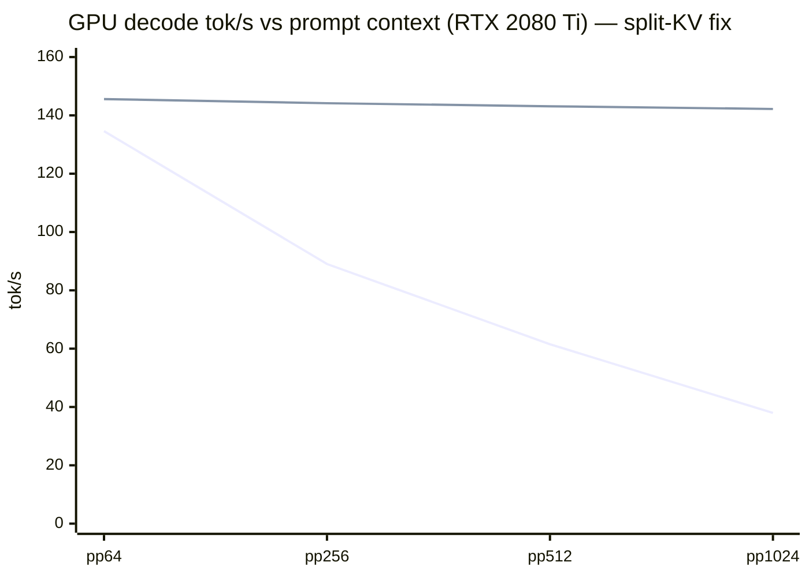

- Red line = eager per-token attention (one warp per q-head, O(context) scan).
- Green line = split-KV decode attention (nHeads × chunks warps) — flat ~142–145 tok/s.

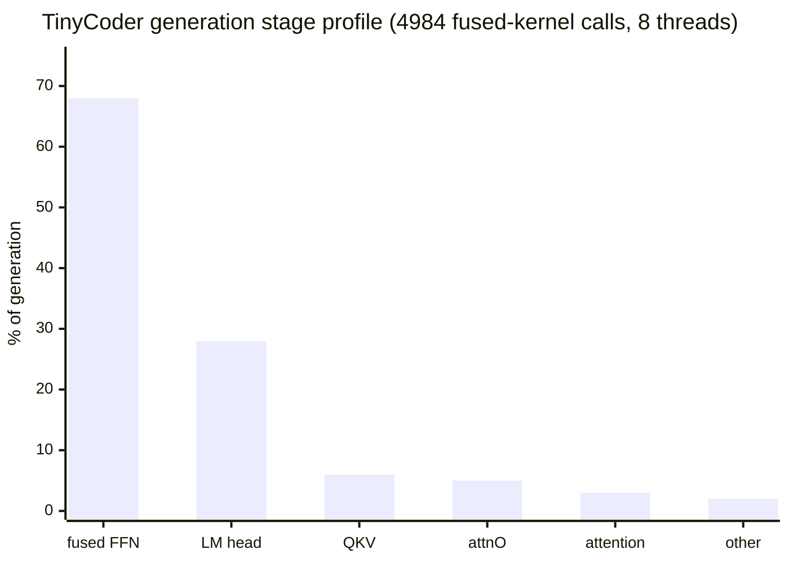

- `fused_gateUp_ffnDown` alone is ~66–70 % of per-token time and is **DRAM-bandwidth-bound**, not ALU-bound.

---

## 2. Full-stack architecture comparison

### 2.1 llama.cpp — graph + multi-backend scheduler

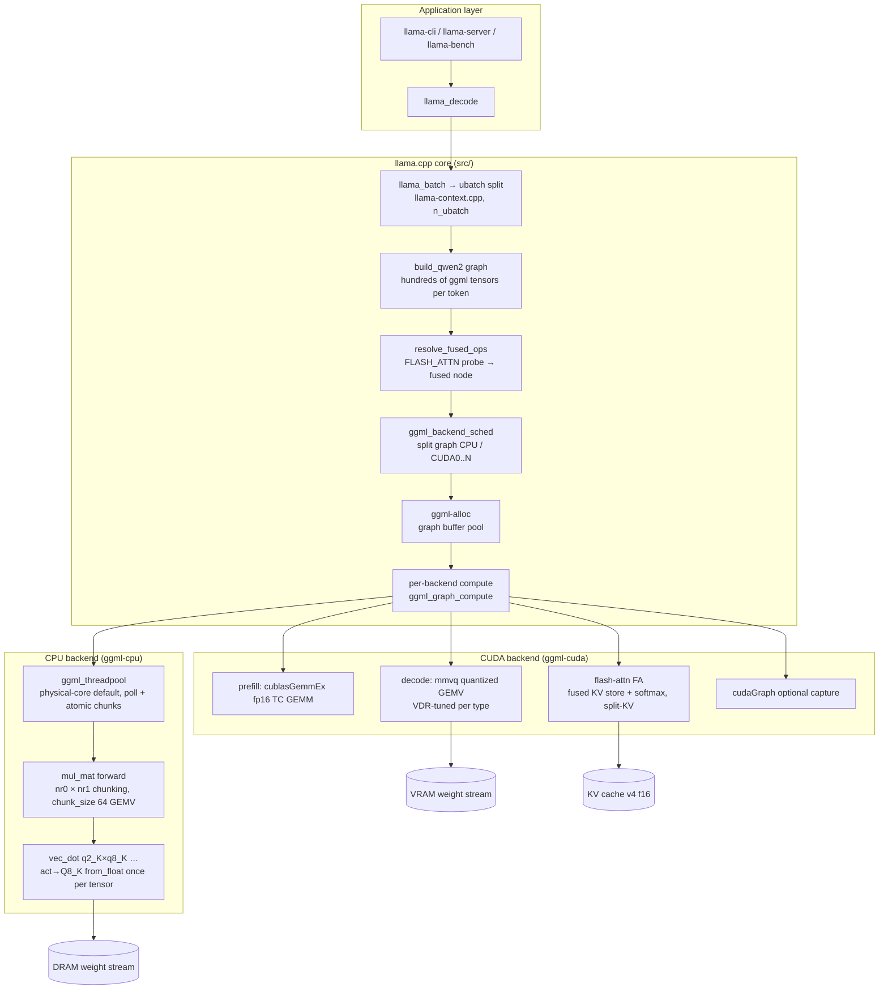

Key properties:

- **Every token is a graph**: topology rebuilt/reused per `n_tokens`; tensors live in a reusable allocator arena.
- **One dispatch per tensor**: each `mul_mat` op is one threadpool task over its whole `(nr0, nr1)` chunk space.
- **Backend abstraction**: ops migrate between CPU/CUDA/others via the scheduler; partial offload (`-ngl`) is a split-point decision, not a different code path.
- **Fused flash attention replaces ~6 ops** per layer (softmax, scale, mask, KV-store) with one fused node resolved at load time.

### 2.2 TinyCoder — imperative fused per-layer loop

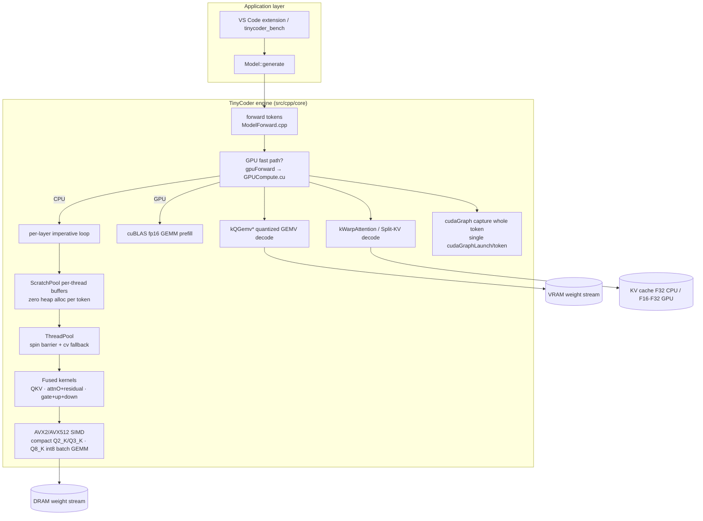

Key properties:

- **Imperative, architecture-specialized code**: `forward()` walks layers and calls hand-fused kernels directly; no op DAG, no backend scheduler, no allocator arena (buffers are hoisted `ScratchPool`s).
- **Fusion goes further than llama.cpp on CPU**: gate+up+down FFN, Q+K fused, attnO+residual, cooperative act→Q8_K quantize are merged into single kernels.
- **GPU path is a second implementation** (`GPUCompute.cu`) with its own kernels and its own CUDA-graph capture of the entire decode token.
- **Weight prep at load time**: prepacked Q2_K copies, FP16/Q8_K twins of attnO/ffnDown, dequantized LM-head embeddings, RoPE tables — trading load time for per-token bandwidth.

---

## 3. Decode (generation) data-flow — side by side

### 3.1 llama.cpp decode step (batch = 1 token)

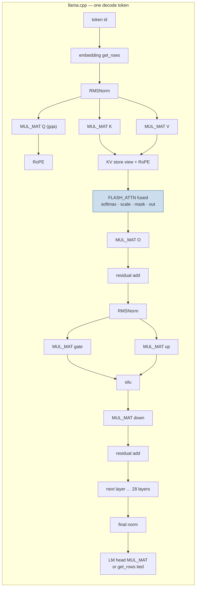

Per layer ≈ **13–15 graph nodes**; llama.cpp *scheduler* parallelizes only inside each op (one dispatch per tensor), so the CPU sees: embed → 28 × (norm, QKV, rope+store, attn, O, add, norm, gate+up, down, add) → norm → head ≈ **~390+ ops/token**, each a separate threadpool barrier.

### 3.2 TinyCoder decode step (batch = 1 token)

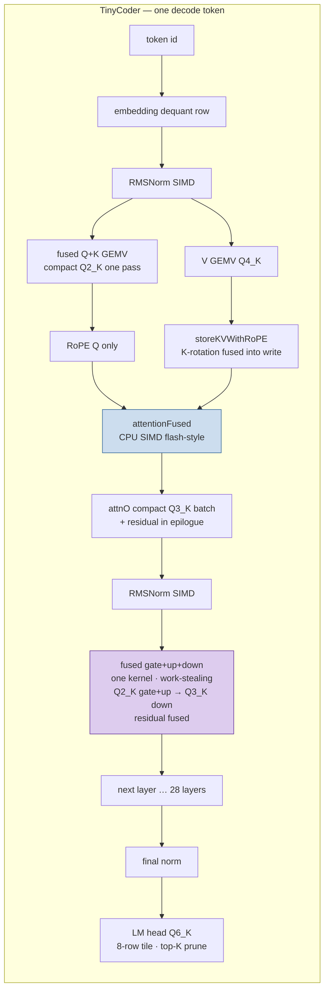

Per layer ≈ **4–6 kernel calls** instead of ~13–15 graph ops. Fusion removes the intermediate buffer round-trips (gate/up → down, attnProj → hidden) and the per-op threadpool barriers — but the *weight bytes streamed from DRAM are the same* (llama.cpp streams identical GGUF blocks), which is why both engines land on the same DRAM floor.

### 3.3 Per-token weight stream (why both are memory-bound)

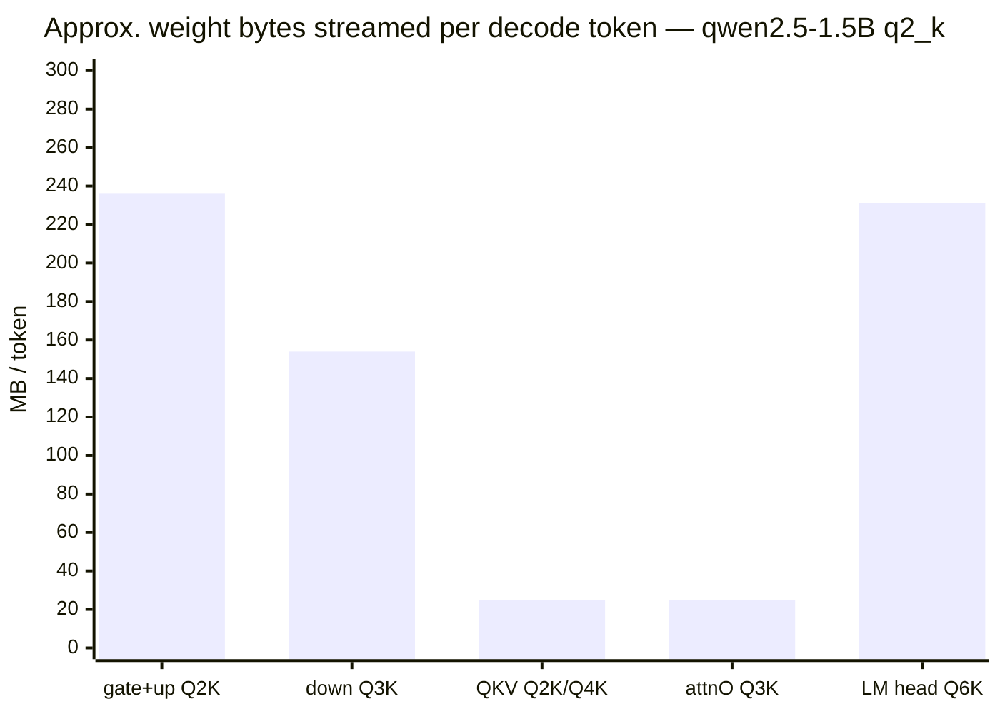

| Stage | Bytes/token | TinyCoder kernel | llama.cpp kernel |
|---|---|---|---|
| FFN gate+up (Q2_K, 8960×1536 ×2) | ~236 MB | fused gate+up, prepacked Q2_K | `MUL_MAT gate` + `MUL_MAT up` (separate) |
| FFN down (Q3_K, 1536×8960) | ~154 MB | fused into gate+up+down | `MUL_MAT down` |
| QKV (Q2_K/Q4_K) | ~25 MB | fused Q+K compact + V | 3 × `MUL_MAT` |
| attnO (Q3_K) | ~25 MB | compact Q3_K + residual | `MUL_MAT O` |
| LM head (Q6_K, 151936×1536) | ~231 MB | 8-row tile Q6_K×Q8_K | `MUL_MAT output` (dequantized or Q8_0) |
| **Total** | **~0.67 GB** | fused | unfused |

> Both engines must pull ~0.67 GB/token through memory. At ~18 GB/s effective (DDR3-1600, 2 channels)
> that is a **~37 ms/token ≈ 27 tok/s hard floor**. TinyCoder at 26.3–26.6 tok/s is within ~0.5–0.7 tok/s
> of that floor; llama.cpp at 26.9 is essentially *at* it.

---

## 4. Threading & scheduling model comparison

```mermaid
flowchart TB
    subgraph LLAMA_THREADS["llama.cpp ggml_threadpool"]
        LTA[default threads = physical cores 4] --> LTB[poll loop per worker]
        LTB --> LTC[tensor op = ONE dispatch<br/>atomic_fetch_add over nr0×nr1 chunks]
        LTC --> LTD["chunk_size = 64 rows (GEMV)<br/>16 (GEMM)"]
        LTD --> LTE[barrier per op → next tensor]
    end

    subgraph TC_THREADS["TinyCoder ThreadPool"]
        TCA[default threads = logical CPUs 8] --> TCB[spin barrier 4096 iters + cv fallback]
        TCB --> TCC["parallelForSlab static partition<br/>OR parallelForSteal dynamic chunks"]
        TCC --> TCD["steal chunk = 4 tiles<br/>phase1 → between → phase2 single launch"]
        TCD --> TCE[affinity pin to distinct logical CPUs]
    end
```

| Aspect | llama.cpp | TinyCoder | Effect |
|---|---|---|---|
| Default thread count | physical cores (4) | logical CPUs (8) | TinyCoder keeps HT lanes busy on memory-bound kernels |
| Dispatch granularity | per tensor, chunked steal (64-row) | per kernel, 4-tile steal chunks | TinyCoder now mirrors llama's steal; +11–14 % at 4 threads |
| Phase fusion | act→Q8_K `from_float` inside op | cooperative last-arriver quantize inside fused FFN | measured net-zero on this host (DRAM-bound hides the bubble) |
| Affinity | none by default | distinct logical CPUs | +0.1–0.8 % @8t, neutral |
| Oversubscription | degrades >physical | **collapses −84 % at 12 threads** on 8-logical host | both suffer; TinyCoder's spin barrier makes it worse |

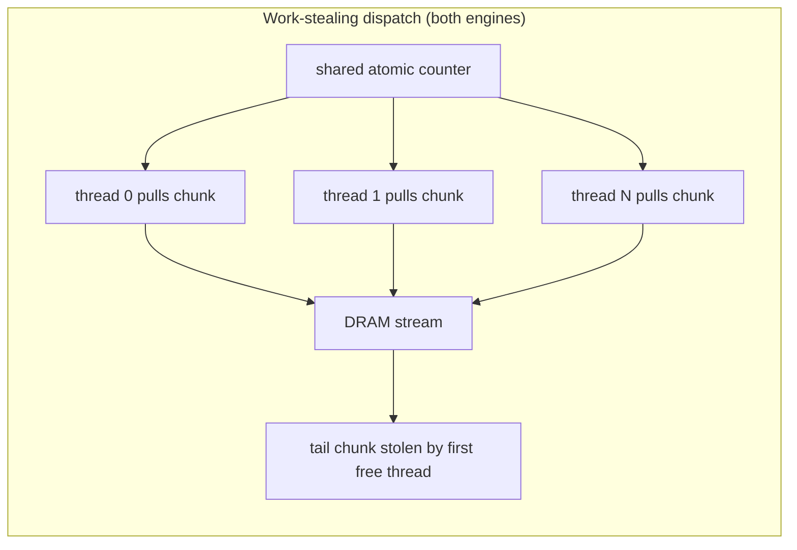

The single largest CPU-generation unlock was porting llama.cpp's `atomic_fetch_add` chunk stealing
into the fused FFN (`parallelForSteal2`, [`ThreadPool.hpp`](../include/ThreadPool.hpp:202)):
4-thread generation went 19.2 → 21.6–22.5 tok/s (**+11–14 %**).

---

## 5. Attention kernel comparison (GPU decode)

### 5.1 llama.cpp flash-attn FA (decode, batch=1)

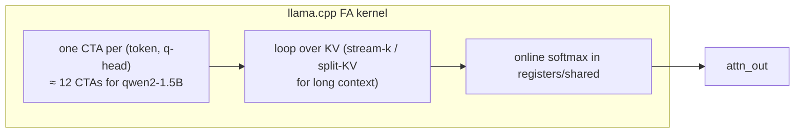

### 5.2 TinyCoder kWarpAttention → split-KV (decode, batch=1)

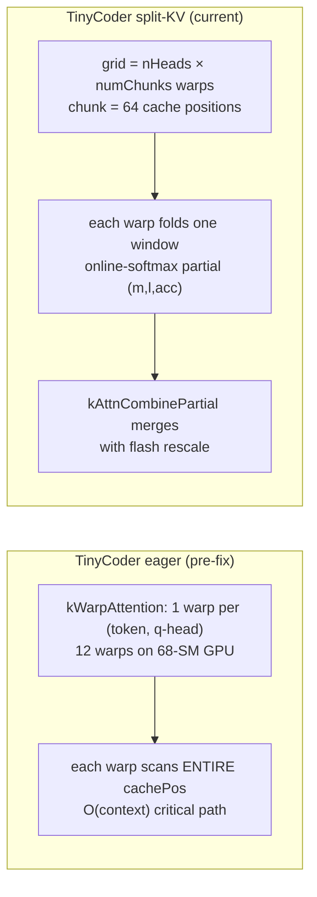

| Context | Eager attn stage | Split-KV attn stage | End-to-end speedup |
|---|---|---|---|
| pp=64 | 0.76 ms | ~0.2 ms | 1.08× |
| pp=256 | 2.88 ms | — | 1.62× |
| pp=512 | 10.31 ms | — | 2.33× |
| pp=1024 | **20.27 ms** | **1.74 ms (11.7×)** | **3.74×** |

Source: [`plans/single_graph_decode.md`](../plans/single_graph_decode.md:41).

---

## 6. CUDA graph usage

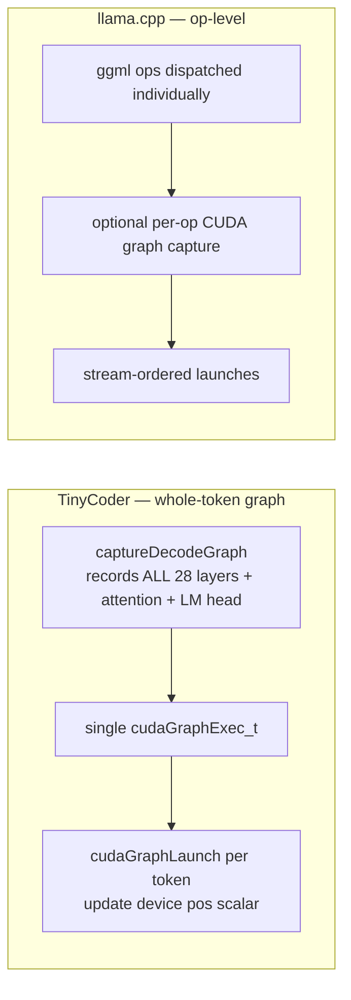

Measured on RTX 2080 Ti: the whole-token graph buys **~0 %** over eager (135.6 vs 136.2 tok/s) because
the GPU is ~97 % busy inside the graph; launch overhead was never the bottleneck
([`plans/single_graph_decode.md`](../plans/single_graph_decode.md:28)). The real wall was attention occupancy.

---

## 7. Prefill comparison

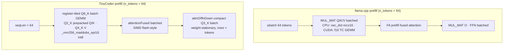

| Aspect | llama.cpp | TinyCoder |
|---|---|---|
| CPU GEMM shape | row-chunked vec_dot, x reused per row | register-tiled over 8 rows, weight-stationary, x→Q8_K once |
| Activation reuse | x quantized once per tensor | x quantized per kernel call (each batch kernel re-quantizes) |
| GPU GEMM | cublas fp16 / mmq | cublasGemmEx fp16 tensor cores |
| LM head | one batched MUL_MAT (all tokens) | skipped for all but last token (`computeAllLogits=false`) |

TinyCoder's unrolled batch kernels lifted qwen35 (27B) CPU prefill from **135 s/token → 6.9 s/token (~19.6×)**
([`README.md`](../README.md:61)); the same class of kernels serves the 1.5B default model.
llama.cpp's equivalent win comes from batching `ne1 = n_tokens` inside its standard `mul_mat`.

---

## 8. Weight-preparation (load-time) differences

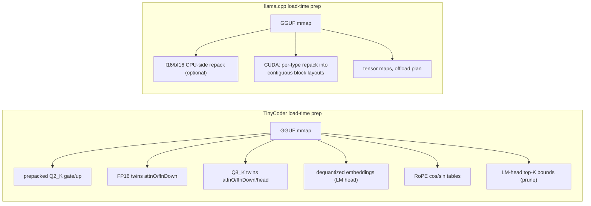

TinyCoder's prep trades memory (extra copies: prepacked + F16 + Q8_K + dequantized embeddings ≈ +50–100 % of
weight size in RAM) for per-token bandwidth. llama.cpp keeps a leaner memory footprint but pays more
per-token conversion ALU in `vec_dot`/`mmvq`.

---

## 9. KV cache structure

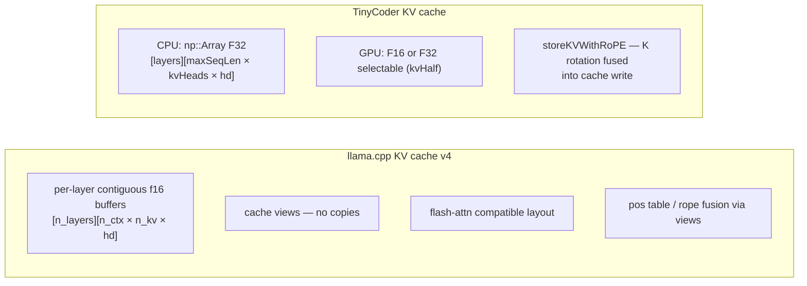

| Aspect | llama.cpp | TinyCoder | Impact |
|---|---|---|---|
| CPU dtype | f16 | **f32** | TinyCoder reads **2×** cache bytes during attention; ~1.4 ms/tok attention stage is small today but grows with context |
| GPU dtype | f16 | f16 (default) / f32 | parity |
| Store | view-based, no copy | fused RoPE write | parity (both avoid a separate K-rotation pass) |
| Parallel sequences | v4 cell indexer, seq-max packing | single sequence (`pos` pointer) | llama.cpp targets multi-seq server use; TinyCoder is single-session |

---

## 10. Where the performance difference actually lives

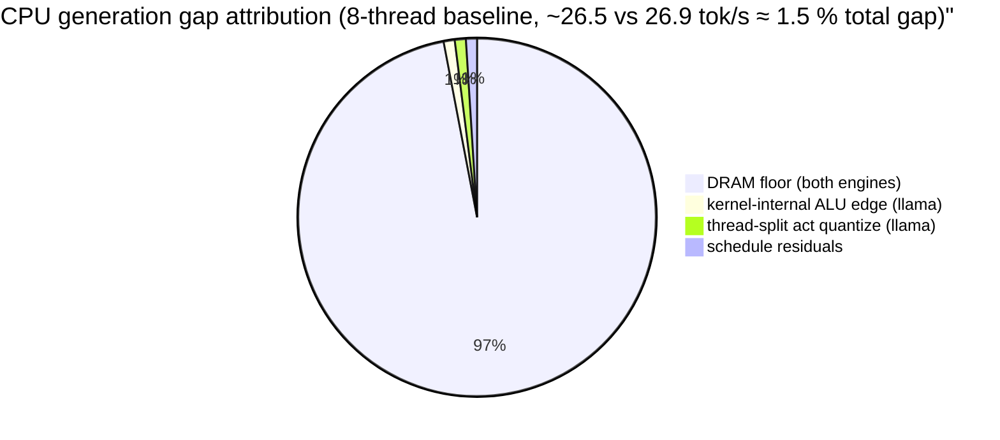

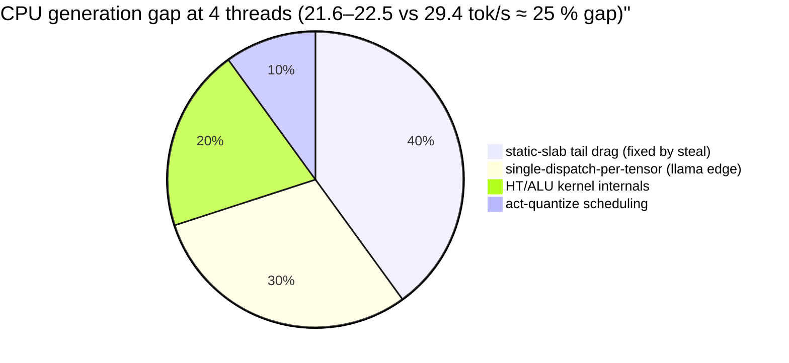

> These pie charts are *qualitative* estimates derived from the A/B levers in
> [`plans/generation_optimizations.md`](../plans/generation_optimizations.md:80) — each lever was
> implemented, measured and either kept or reverted. They are not profiler-attributed percentages.

---

## Appendix A. Source map (where each diagram's facts live)

| Topic | llama.cpp | TinyCoder |
|---|---|---|
| Decode graph build | `src/models/qwen2.cpp` (build_qwen2) | [`ModelForward.cpp`](../src/cpp/core/ModelForward.cpp:251) |
| Fused flash attention resolve | `src/llama-context.cpp:504` | [`GPUCompute.cu`](../src/cpp/core/GPUCompute.cu:325) |
| mul_mat chunk stealing | `ggml/src/ggml-cpu/ggml-cpu.c:1254` | [`ThreadPool.hpp`](../include/ThreadPool.hpp:202) |
| CPU vec_dot / quant | `ggml/src/ggml-cpu/arch/x86/quants.c` | [`SIMDMatMulVecAVX2.cpp`](../src/cpp/core/SIMDMatMulVecAVX2.cpp:5042) |
| CUDA mmvq GEMV | `ggml/src/ggml-cuda/mmvq.cu` | [`GPUCompute.cu`](../src/cpp/core/GPUCompute.cu:774) |
| Prefill GEMM | cublasGemmEx (fp16) | [`GPUCompute.cu`](../src/cpp/core/GPUCompute.cu:11919) |
| Thread default policy | `ggml-cpu` physical cores | [`ThreadPool.hpp`](../include/ThreadPool.hpp:96) |
| KV cache | `src/llama-kv-cache.cpp` | [`Model.hpp`](../include/Model.hpp:700) |
| Benchmark harness | `tools/llama-bench` | [`benchmarks/BenchMain.cpp`](../benchmarks/BenchMain.cpp:1) |